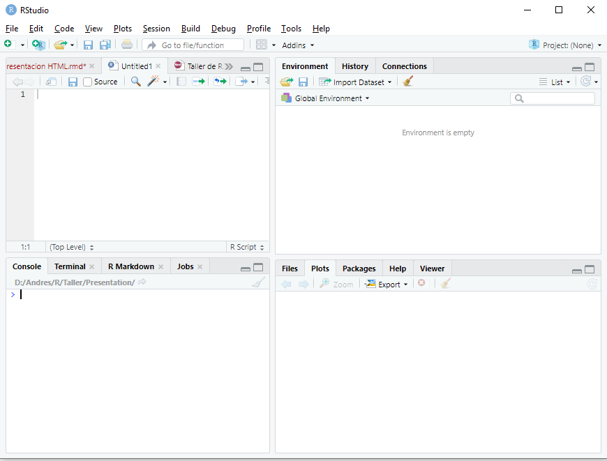

## Accedé al curso completo [aquí](curso_completo/curso_completo.qmd) {.unnumbered}

## Descarga el material del curso [aquí](https://github.com/andresblanco-unc/curso_graficos_ggplot_2026/raw/refs/heads/main/archivos_curso_ggplot_2026.rar) {.unnumbered}

## Bibliografía recomendada {.unnumbered}

- Carmona, D.; Benitez-Vieyra, S. Guía de campo de R. [Link](https://wiki.imbiv.unc.edu.ar/index.php?title=Guía_de_campo_de_R){target="_blank"}
- Chang, W. (2018). R graphics cookbook: practical recipes for visualizing data. O'Reilly Media. [Link](http://www.cookbook-r.com/){target="_blank"}
- Ggplot2 Reference. [Link](https://ggplot2.tidyverse.org/reference/){target="_blank"}
- Morales, J. Modelos estadísticos, una versión aplicada en R. [Link](https://bookdown.org/j_morales/librostat/){target="_blank"}
- R-Charts. Gráficos con el paquete ggplot2. [Link](https://r-charts.com/es/ggplot2/){target="_blank"}
- Tidyverse. [Link](https://www.tidyverse.org/){target="_blank"}
- Wickham, H.; Çetinkaya-Rundel, M.; Grolemund, G. (2023). R for data science. O'Reilly Media. [Link](https://r4ds.hadley.nz/){target="_blank"}

------------------------------------------------------------------------

### Otros cursos orientados al uso de R {.unnumbered}

En el Doctorado de Ciencias Biológicas (FCEFyN, Universidad Nacional de Córdoba), se dictan con regularidad cursos introductorios y avanzados de modelos estadísticos en R:

- **Introducción al lenguaje R. Modelos lineales y fundamentos de programación**. [Ver curso](https://curso-statscba.github.io/curso-R/){target="_blank"}
- **Modelos Estadísticos Avanzados**. [Ver curso](https://curso-statscba.github.io/modelos_avanzados/){target="_blank"}
- **Fundamentos básicos del lenguaje R**. [Ver curso](https://pastornicolas.github.io/fundamentos_R/){target="_blank"}

------------------------------------------------------------------------

## Licencia {.unnumbered}

© 2026 Andrés Blanco. Bajo licencia [Creative Commons Attribution-NonCommercial-ShareAlike 4.0 International License](http://creativecommons.org/licenses/by-nc-sa/4.0/){target="_blank"}.

[](http://creativecommons.org/licenses/by-nc-sa/4.0/)


# Objetivos {.unnumbered}

El objetivo principal del curso es que los asistentes obtengan herramientas para la generación y manejo de gráficos utilizando lenguaje R y el software RStudio, con especial énfasis en la escritura de capas que requiere el paquete ggplot2.

# Contenidos {.unnumbered}

1.  Unidad 1. Introducción a R y RStudio. Presentación de los programas. Estructura del script de trabajo. Carga de datos y librerías. Caracterización analítica y gráfica de las variables. Tipos de objetos. Paquete dplyr para manejo y conversión de las bases de datos.\
2.  Unidad 2. Análisis y representación de datos numéricos. Correlación lineal en R. Gráficos de correlaciones. Regresión lineal. Gráficos de supuestos. Gráficos de puntos: función plot y lineplot.CI. Manejo de parámetros gráficos. Ggplot2: introducción al paquete, gráficos de puntos y líneas. Gráfica del modelo lineal. Cálculos de media y desvío estándar para gráficos.
3.  Unidad 3. Análisis y representación de datos categóricos. ANOVA a 1 factor y bifactorial. Pruebas de supuestos y test a posteriori. Gráficos de barras: función bargraph.CI y geom_col. Gráficos de cajas: función boxplot y geom_boxplot. Manejo de escalas e incorporación de resultados estadísticos.
4.  Unidad 4. Estructura y estética de gráficos con ggplot2. Estructura por capas. Faceting y división por factores. Definición del theme. Manipulación de la base de datos a graficar. Escalas de colores, uso de paletas. Clasificación por color, tipo de línea y forma. Combinación de gráficos: funciones layout, grid.arrange y paquete patchwork.
5.  Unidad 5. Otros tipos y parámetros gráficos. Gráficos de áreas. Combinación de distintos geoms. Eje secundario. Pivoteo de bases de datos. Gráficos de biplot para análisis de componentes principales. Exportación de gráficos: devices y ggsave. Manipulación externa de gráficos.

# Introducción a R y RStudio

## El lenguaje R

R es un lenguaje de escritura propio. Como todo lenguaje, tiene la gran virtud de que permite la comunicación a través de él, se puede intercambiar, podemos "hablarlo" en todas partes del mundo, compartir *scripts* con colegas y mostrarles cómo analizamos los datos. Sin embargo, su principal virtud es también su kryptonita ya que, como todo lenguaje, tiene muchos modismos. Cada persona desarrolla su propia forma de escritura, arma los *scripts* como le parece conveniente, entendible, práctico. Uno mismo a lo largo del tiempo va perfeccionando sus propios escritos, corrigiendo lo antes hecho, reescribiendo con un estilo más refinado o más avanzado.

Mi reflexión a este respecto es que la experiencia con el software es dinámica, aquí no se pretende mostrar una receta cerrada que no se puede modificar (ni mucho menos), sino simplemente acercar el programa a aquellos que aún no lo conocen y permitirles dar los primeros pasos para luego iniciar su propio camino.

## Ventajas y desventajas de R

Por supuesto este apartado es totalmente subjetivo y (al igual que todo este escrito) está enteramente marcado por mi experiencia personal. La principal desventaja salta a la vista: hay que aprender un lenguaje nuevo de escritura. De esta desventaja se desprende su principal limitación: requiere tiempo aprenderlo. El uso de R requiere tener paciencia, leer, aprender a utilizarlo, frustrarse, reintentar, googlear buscando ayuda, etc. Por otra parte, la flexibilidad de escritura a veces dificulta el entendimiento. Finalmente algo que puede parecer una desventaja (que ya veremos que no lo es) es que en algunos casos puede llevarnos bastante tiempo llegar a un gráfico aceptable de acuerdo a nuestro requerimientos, gráfico que a simple vista pareciera haber sido mucho más rápido hacerlo en otro software ya conocido (como excel).

De ahí en más, presenta muchas virtudes:

- En primer lugar es software libre, al acceso de todos y multiplataforma.
- Se usa en investigación en todas partes del mundo, lo que nos permite realizar intercambios con otros investigadores, mandar scripts a nuestros directores, colegas, consultar análisis de otros.
- En lo personal, nos facilita seguir paso a paso cómo analizamos nuestros propios datos. Pongamos por caso que luego de 2 años queremos revisar unos datos que ya habíamos analizado y que nos quedaron colgados...acá podemos ver paso a paso todo lo que hicimos (también es cierto que si seguimos avanzando en el programa, nuestra forma de escritura habrá mutado, pero eso no lo hará menos entendible).
- Otra ventaja, relacionada a la anterior, es la posibilidad de introducir comentarios en nuestros scripts. Todo lo que aparezca a la derecha del signo `#` en una línea no formará parte de la corrida. Esto nos permite agregar anotaciones, incluso resultados, hacernos recordatorios, silenciar partes del script que no queramos que se ejecuten, etc.
- La esencia de R es la capacidad de repetición. Retomando lo que mencioné como una supuesta desventaja (pero que no lo era), una vez que logramos un gráfico (puede ser también un comando, pero vale el ejemplo) que estéticamente nos agrada, es muy sencillo extrapolar esa apariencia a otro gráfico, aún de diferente tipo. Por lo tanto, todo ese tiempo que nos llevó armarlo, es inversión y aprendizaje para que la siguiente vez todo sea más rápido.
- El uso de funciones: relacionado al ítem anterior, y una vez que tengamos algo de manejo, podemos armar las funciones que nosotros queramos reuniendo los análisis que queramos ver y simplificar los comandos para que en una sola línea generemos mucha información.

Por supuesto que todas estas ventajas y desventajas han sufrido grandes modificaciones desde la irrupción de la inteligencia artificial. Hoy en día es muy fácil armar funciones complejas, gráficos muy avanzados y scripts infinitos sin tener grandes conocimientos. El objetivo de este curso es sentar las bases para que dicho uso sea medido y comprendido, además de poder realizar modificaciones manuales que creamos convenientes. En este sentido, es una invitación de este curso intentar trabajarlo sin la ayuda de la IA, aunque más no sea la última vez que trabajemos de esta forma.

## Instalación de R

En windows, se debe descargar la última versión de R desde su web (<https://cran.r-project.org/bin/windows/base/>), e instalarlo como cualquier otro programa.

## RStudio

RStudio es un software que nos va a permitir trabajar de un modo más amigable con R (que de forma nativa se utiliza en un entorno tipo terminal de programación). El programa es de uso libre y se descarga desde la web oficial (<https://posit.co/download/rstudio-desktop/>). Una vez que instalamos el programa y lo abrimos, nos ofrece muchísimas posibilidades. En este taller simplemente vamos a ver su uso básico.

Actualmente otros softwares están irrumpiendo en escena con bastante más soporte para inteligencia artificial (como es el caso de [Visual Code Studio](https://code.visualstudio.com/), o la versión de Posit llamada [Positron](https://posit.co/products/ide/positron/)). Sin embargo, considero que RStudio es una herramienta algo más amigable para una iniciación al software.

Al abrir el programa lo primero que destaca es que se encuentra dividido en 4 ventanas:



1.  Ventana 1 - Script de trabajo: arriba a la izquierda. En ella abriremos y editaremos nuestros scripts de trabajo. A medida que se escriben las líneas para ejecutarlas debemos posicionarnos en ella (o seleccionarla) y correrlas (Run, arriba a la derecha, o más fácil *Ctrl + r*).

2.  Ventana 2 - consola: se ubica abajo a la izquierda. En ella se nos muestra el R propiamente dicho. Todo lo que nosotros ejecutamos en la ventana 1 se corre en esta segunda ventana, donde se nos muestra el resultado de nuestra corrida. Si se quiere se puede escribir directamente en ella, pero lo que hagamos no quedará guardado en nuestro script de trabajo.

3.  Ventana 3 - objetos e historial: arriba a la derecha. Aquí podemos visualizar (en la pestaña *Environment*) todos los objetos, bases de datos, funciones, etc. que hayamos importado o creado. Es muy importante ya que nos permite tener en vista nuestro entorno de trabajo (que es una funcionalidad con la que el R nativo no cuenta, uno debe memorizar los objetos creados). Si se tilda en alguno de los objetos, es equivalente a ejecutar el comando `View()`, y nos permite visualizar en forma de tabla nuestras bases de datos (se abren en la ventana 1). Contamos aquí con una opción gráfica para importar nuestras bases de datos, pero en este curso lo haremos directamente con código. También contamos con una escoba que nos permite borrar todos los objetos que tengamos. La segunda pestaña *History* nos permite precisamente ver el historial de corridas que hayamos hecho. Allí podemos revisar comandos que ya ejecutamos y queremos repetir.

4.  Ventana 4 - gráficos, paquetes y ayuda: abajo a la derecha. Usaremos 3 de las pestañas:

- *Plots*: aquí visualizaremos todos los gráficos que vayamos generando. Nos permite mediante las flechas de arriba a la izquierda ir viendo también los gráficos anteriores. El icono Zoom nos facilita la visualización externa del gráfico que estemos viendo. Además presenta opciones de exportación.
- *Packages*: aquí podemos visualizar la lista completa de paquetes que tenemos instalados. Si tildamos uno lo activamos (equivalente al comando `library`, ver más adelante). Si tildamos en *Install* podemos agregar nuevos paquetes que estén en el CRAN (base de datos de librerías).
- *Help*: como bien dice el nombre es la ventana de ayuda. Súper útil y de consulta constante. Allí podemos ver las descripciones que escribieron los creadores de cada función y/o paquete que usemos.

Como se ve RStudio nos permite realizar diversas acciones de forma gráfica, sin necesidad de utilizar código. Mi postura en general es dejar escrito en nuestro script la mayor cantidad de pasos posibles, ya que todo lo que hagamos de forma gráfica no nos queda disponible cuando volvamos a ver nuestro archivo. En este sentido, la instalación de paquetes o las búsquedas de ayuda no es algo que necesitemos en un futuro en nuestro script y podemos hacerlo de forma gráfica. Pero, contrariamente, la carga de la base de datos, paquetes, exportación de figuras, nos resultará de utilidad dejarlo plasmado en el escrito.

RStudio incluye un infinidad de opciones extra que no hacen al objetivo de este curso. Para usos más avanzados es recomendable revisar la página web de los creadores, que es muy completa e incluye muchas utilidades y tutoriales. También se encuentra mucha ayuda en la pestaña Help.

## Script de trabajo

En este apartado comenzaremos propiamente a desarrollar un script de trabajo. Iremos viendo paso a paso como avanzar en su armado, desde la carga de las librerías, introducir la base de datos y el manejo de la misma, el análisis de los datos hasta la visualización gráfica de los mismos.

Lo primero que hay que hacer un vez ingresados en RStudio es crear un nuevo script (File -\> New File -\> R Script). Allí nosotros podremos ir desarrollando los comandos correspondientes.

Todo script de trabajo tiene una estructura similar, la que yo utilizo es:

- Carga de las librerías.
- Carga de la base de datos.
- Creación de las databases necesarias.
- Armado de las funciones necesarias (si es que las tuviéramos).
- Análisis de los datos separados por títulos.

Los títulos son marcas que hacemos para volver sencillamente a otras partes de nuestro script (tengamos en cuenta que fácilmente se superan las 1000 líneas). Para introducir un título (o marcador) colocamos la palabra clave como un comentario y agregamos una serie de signos - a la derecha. Por ejemplo:

```{r eval=FALSE}
# Librerías ------
```

A partir de este momento podemos ver nuestros títulos en 2 lugares: en la parte inferior izquierda de la ventana 1 o en la parte superior derecha de la misma ventana en el icono con la leyenda *Outline*. Esta estructuración, insisto, es muy útil para movernos dentro del documento sin perder mucho tiempo buscando algún comando. A su vez, si introducimos más \# al comienzo, se generan títulos de un nivel inferior.

## Instalación y carga de las librerías

R se maneja en base a paquetes (o librerías) que contienen las funciones que queramos utilizar. Como base R trae pre-instalados una serie de paquetes que nos sirven para realizar gran cantidad de aplicaciones. Sin embargo, es muy usual que prefiramos usar otras funciones no disponibles en la base.

Para instalar una librería debemos ejecutar el código

```{r eval=FALSE}
install.packages("nombre del paquete")
```

La instalación de paquetes debemos realizarla una única vez. Como se mencionó al describir la Ventana 4, también podemos instalar los paquetes de un modo gráfico en la pestaña Packages de RStudio.

Cada vez que ingresamos a RStudio debemos cargar nuestras librerías a utilizar. Para cargar una librería utilizamos el código

```{r eval=FALSE}
library("nombre del paquete")
```

Si queremos cargar varios paquetes, podemos ejecutar varios comandos library en una misma línea separándolos con ";", y así cargar todos en una única línea de corrida (Ctrl + r). Por otro lado, si bien uno puede tener un conjunto de paquetes que utiliza habitualmente, no es recomendable cargar de más ya que muchas veces se solapan funciones y podemos tener alguna complicación.

Para el uso de este taller, instalaremos los paquetes **agricolae**, **car**, **sciplot**, **patchwork**, **gridExtra** , **viridis** y **tidyverse**. Este último incluye una serie de paquetes en su interior, que abarcan desde funcionalidades gráficas hasta opciones del manejo de datos.

Así podemos cargarlos todos de la siguiente manera:

```{r  librerias, results='hide', message=FALSE}
library(agricolae);library(tidyverse);library(car)
library(sciplot);library(patchwork); library(gridExtra)
library(viridis)
```

## Carga de nuestros datos

Como para casi cualquier acción que queramos ejecutar en R, la carga de la base de datos puede hacerse de muchas maneras. En la ventana 3 se nos ofrece una opción gráfica (a través de "Import Dataset").

De todas maneras, es recomendable hacerlo mediante código, para que cada vez que ingresemos podamos incorporar la base de datos de manera muy sencilla.

### Establecer el directorio de trabajo

Lo primero que debemos hacer es establecer el directorio de trabajo. Para ello corremos el comando (con un directorio ejemplo):

```{r eval=FALSE}
setwd("D:/DATOS/R")
```

Si queremos revisar en qué directorio nos encontramos, ejecutamos

```{r eval=FALSE}
getwd()
```

Ahora antes de ver cómo cargar la base de datos, haremos una breve explicación de como crear la base de datos.

### Armado de la base de datos

Una vez más, aquí mostraré mi forma de armar las bases de datos, hay muchas...

La forma de la base de datos es la misma que se utiliza en otros software como Infostat. Debemos crear una columna por cada factor o variable que tengamos, y repetir el nivel del factor para cada unidad experimental (cada fila).

El formato en el que yo creo mis bases de datos es csv (archivo separado por comas). Para ello se exporta desde Excel o Calc el archivo en ese formato. El documento debe tener una única hoja con las base de datos limpia, es decir sin columnas o filas extras con comentarios, datos extra, etc. Por otro lado, es recomendable que los nombres de las columnas sean lo más cortos posibles, y que no tengan espacios. Otra recomendación es omitir el uso de tildes u otros caracteres especiales en cualquier parte del documento puede llegar a tener problemas según la codificación que usemos en RStudio. La más compatible es la UTF-8, que no suele generar problemas.

Resumiendo, la recomendación es que una vez que tenemos nuestra tabla (en Excel por ejemplo) con los datos listos, copiarla y pegarla en un documento nuevo. Allí ver de simplificar los nombres de las columnas, también de los niveles de factores a utilizar. Guardar este nuevo documento como csv, si estamos en idioma español establecer para la separación de columnas ";". Por supuesto, guardamos el archivo en el directorio de trabajo.

Para este curso utilizaremos inicialmente la base de datos "peces_morfometria.csv".

### Cargando la base de datos

R es un lenguaje orientado a objetos. Por lo tanto, cargaremos nuestra base de datos como un "objeto" de R, al cual debemos asignarle un nombre. De ahí en más, cualquier acción que modifique nuestro "objeto" quedará guardada en el objeto mismo, pero no modificará nuestro archivo original (el csv en este caso). Para crear un objeto lo asignamos con "**\<-**" (de forma rápida se escribe con *Alt + -*) o con el signo "**=**".

Una primera forma de cargarla es mediante la función read.csv, y se pueden establecer un par de parámetros:

```{r}
datos_peces <- read.csv("data/peces_morfometria.csv", dec=".", sep=",")
lapply(datos_peces, class) # vemos que crea factores
```

La función que yo más utilizo es la que viene con el paquete **tidyverse**, llamada `read_csv`. Si usamos `read_csv2`, toma la coma como separador decimal:

```{r warning=FALSE}
datos_peces <- read_csv("data/peces_morfometria.csv")
```

Vemos que en este caso nos mostró directamente la clase de cada columna, y que crea objetos tipo *character* en vez de *factor*.

En la ventana 3, nos aparecerán los objetos que incorporemos.

## Caracterización de la base de datos

Para ver los primeros 6 datos y los nombres de las columnas ejecutamos la función `head`:

```{r}
head(datos_peces)
```

Para ver la tabla completa, se debe tildar en el nombre del objeto en la ventana 3. Aprovechando que tenemos la tabla a nuestra vista, daré aquí una breve descripción de los datos. Esta base de datos contiene registros morfométricos, fisiológicos y ambientales de peces colectados en tres lagunas pampeanas de la región central de Argentina. Se incluyen tres especies nativas con rangos de talla muy distintos, lo que la hace especialmente útil para explorar relaciones alométricas, correlaciones entre variables continuas y comparaciones entre grupos. Las variables registradas son:

- **id:** Identificador numérico único de cada individuo.

- **especie:** Especie a la que pertenece el individuo (*Odontesthes bonariensis*, *Jenynsia multidentata* o *Cichlasoma dimerus*).

- **sitio:** Laguna de muestreo (Laguna Norte, Laguna Sur o Laguna Central).

- **sexo:** Sexo del individuo (M/F).

- **temporada:** Temporada de muestreo (Verano o Invierno).

- **longitud_cm:** Longitud total del pez en centímetros.

- **peso_g:** Peso corporal en gramos. Se relaciona con la longitud mediante una función alométrica (W = a·L\^b).

- **temperatura_C:** Temperatura del agua en el momento del muestreo, en °C.

- **transparencia_cm:** Transparencia del agua medida con disco de Secchi, en centímetros.

- **cortisol_ugdL:** Concentración plasmática de cortisol en µg/dL, utilizada como indicador de estrés fisiológico.

Siguiendo con el análisis de nuestra base de datos, podemos ver un resumen de nuestra base o hacerle "preguntas" a R sobre la base de datos. Al escribir "\$" a continuación de un objeto podemos ver las columnas individuales. Por ejemplo:

```{r}
summary(datos_peces) # resumen de la base
is.double(datos_peces$temperatura_C) # double indica numérico continuo
is.character(datos_peces$longitud_cm)
levels(as.factor(datos_peces$especie)) # para ver los niveles de un factor
as.character(datos_peces$transparencia_cm)
```

### Caracterización gráfica

En este caso haremos algunos gráficos sencillos para observar la distribución de nuestra base de datos. La función `plot` (y sus derivados, como en este caso `boxplot`) viene con R base y es la forma más rápida y sencilla de graficar.

```{r, out.width='50%'}
#| layout-ncol: 2
plot(datos_peces$longitud_cm)
plot(datos_peces$longitud_cm~datos_peces$temperatura_C)
boxplot(datos_peces$peso_g~datos_peces$especie)
boxplot(datos_peces$peso_g~datos_peces$sitio)
```

## Manejo de la base de datos

### Subdividir la base de datos

Algo muy común en el trabajo en R, es la necesidad de subdividir la base de datos para utilizar únicamente una parte de ella. Veremos un par de formas de hacerlo.

Con las funciones que incluye R base, utilizaremos `subset`. Por ejemplo para elegir solo las muestras de la especie *Jenynsia multidentata*:

```{r}
JENYNSIA <- subset(datos_peces, datos_peces$especie == "Jenynsia multidentata")
```

Y creamos un objeto que se llama *JENYNSIA*, nuevamente mediante *\<-*.

Otra forma de hacerlo es mediante el uso de pipes (**%\>%**). Las pipes sirven para concatenar una serie de acciones para modificar una base de datos. En primer lugar se ubica la base a modificar y entre cada linea de comando %\>% (*Ctrl + Shift + m*). Así, podemos filtrar una base de datos con `filter`:

```{r}
Laguna_Central <- datos_peces %>% filter(sitio == "Laguna Central")
```

Si queremos filtrar por más de un parámetro:

```{r}
# en dos pasos
Peces_Invierno <- datos_peces %>% 
  filter(temporada == "Invierno") %>% # se agrega a lo anterior
  filter(especie == "Cichlasoma dimerus" | especie == "Odontesthes bonariensis")
```

### Seleccionar filas o columnas

En R base, el uso de \[ \] sirve para seleccionar filas o columnas de una database, tal que `data[filas,columnas]`. En el entorno de *dplyr* utilizaremos la función `select` para columnas:

```{r}
# seleccionar filas 1 a 3
datos_peces[1:3,]

# seleccionar columnas 1 a 3
datos_peces[,1:3]
datos_peces %>% select(1:3)

# seleccionar por nombre de la columna
datos_peces %>% select(sitio, especie)
```

### Creación de nuevas variables

Una opción muy útil ligada al paquete **dplyr** es la de transformar nuestras bases de datos para algún gráfico en particular, sin necesidad de cambiar la tabla original. Para ello utilizaremos la función `mutate`, que permite generar muchos cambios en la base de datos. Por ejemplo, en la base `datos_peces`, si queremos agregar la la variable peso por unidad de longitud:

```{r}
datos_peces <- datos_peces %>% 
  mutate("peso_relativo" = peso_g/longitud_cm) # se crea una nueva columna

# para ver la columna nueva
head(datos_peces$peso_relativo)
```

### Cambio en los niveles de un factor

También podemos cambiar los niveles de una factor `mutate`, mediante la siguiente estructura:

```{r eval=FALSE}
... %>%
  mutate(nombre_factor = fct_recode(nombre_factor,
                        "nombre nuevo" = "nombre viejo"))
```

Y podemos incluir una línea para cada nivel que queramos modificar. Por ejemplo:

```{r out.height="50%"}
datos_peces <- datos_peces %>% 
  mutate(sexo = fct_recode(sexo,
                           "Macho" = "M",
                           "Hembra" = "F"))
```

## Actividad 1

1.  Cree a partir de la base de datos original, una que contenga únicamente los individuos de la especie *Cichlasoma dimerus y Odontesthes bonariensis* que se encuentran en la Laguna Norte en invierno.
2.  Filtre la base creada para obtener otra que solo tenga aquellos individuos con peso relativo mayor a 1.

# Unidad 2. Análisis y representación de datos numéricos

Veremos los análisis a realizar para procesar variables continuas (correlación y regresión) y como representarlas gráficamente de una forma más detallada que como lo vimos hasta ahora.

## Correlación

Cuando queremos evaluar la relación entre 2 variables continuas, sin establecer relaciones de dependencia, el análisis que debemos hacer es un análisis de correlación lineal. El test de correlación lineal más utilizado es el de correlación de Pearson, que nos arroja el coeficiente de Pearson, que toma valores entre -1 y 1, según la relación sea inversa o directa. Valores cercanos a cero indican falta de relación entre las variables. La correlación de Pearson tiene como supuestos la distribución normal de las variables (entre otros). Debemos poner a prueba esos supuestos para poder realizar este tipo de análisis.

Comenzaremos creando una base de datos de los individuos de *Odontesthes bonariensis*:

```{r warning=FALSE }
PEJERREY <- datos_peces %>% filter(especie == "Odontesthes bonariensis")
```

Veremos primero como analizar de a pares de variables. Lo recomendable es iniciar con una exploración gráfica de los datos, en este caso vamos a relacionar la longitud con el peso de los individuos.

```{r, out.width='50%'}
#| layout-ncol: 2
# Exploración gráfica

plot(PEJERREY$longitud_cm, pch = 19)

plot(PEJERREY$peso_g, pch = 17)

plot(PEJERREY$longitud_cm, PEJERREY$peso_g)

plot(PEJERREY$longitud_cm)
```

Ahora veremos cómo hacer la correlación de pearson, de momento ignorando los supuestos:

```{r warning=FALSE}
cor.test(PEJERREY$longitud_cm, PEJERREY$peso_g, method = "pearson")
```

Vemos que nos arroja los resultados del valor del coeficiente lineal de pearson y su valor p asociado.

### Análisis de normalidad

En esta sección veremos cómo poner a prueba la normalidad de nuestros datos con el test de Shapiro Wilk y como visualizarlo gráficamente en un qqplot. Recordemos que la hipótesis nula del test es que los datos son normales, por lo que si rechazamos la hipótesis (p\<0,05) no hay normalidad:

```{r out.width="50%", fig.show='hold'}
#| layout-ncol: 2
# Forma analítica

shapiro.test(PEJERREY$longitud_cm)
shapiro.test(PEJERREY$peso_g)

# Forma gráfica
qqnorm(PEJERREY$longitud_cm)
qqline(PEJERREY$longitud_cm, col="red", lwd=2)

qqnorm(PEJERREY$peso_g)
qqline(PEJERREY$peso_g, col="red", lwd=2)
```

Vemos que para ambos casos las variable presentan un comportamiento normal de acuerdo al test analítico y al gráfico.

Si quisiéramos hacer una transformación de nuestros datos, en R lo podemos hacer directamente:

```{r eval=FALSE}
shapiro.test(log(PEJERREY$peso_g+1)) # convertimos al logaritmo en base 10

qqnorm(log(PEJERREY$peso_g+1))
qqline(log(PEJERREY$peso_g+1), col="red", lwd=2)
```

Si no logramos de ninguna manera corregir la normalidad, podemos también correr el test no paramétrico de Spearman que no tiene supuestos asociados, aunque también presenta menor potencia. En este caso el coeficiente es el coeficiente de Spearman (*rho*):

```{r warning=FALSE}
cor.test(PEJERREY$longitud_cm, PEJERREY$peso_g, 
        method = "spearman", exact = TRUE)
```

### Muchas columnas a la vez

Existen otros test que permiten correlacionar pares de variables pero correrlas todas a la vez. A diferencia de la función `cor.test` que solo admite 2 variables, la función `cor` permite cargar una serie de columnas y luego podemos ver los coeficientes en forma matricial:

```{r}
CORR <- cor(PEJERREY[, c("longitud_cm", "peso_g", "temperatura_C", "transparencia_cm")],
            method = "pearson")
CORR # obtenemos los coeficientes
```

Otra función de utilidad que nos permite ver los coeficientes y los valores *p* al mismo tiempo es la función `rcorr` del paquete **Hmisc**:

```{r, message=FALSE}
library(Hmisc)
CORR_Pejerrey <- rcorr(as.matrix(PEJERREY[,6:9]))
CORR_Pejerrey # aquí observamos primero los valores de coeficientes y luego el valor p
```

Ahora veremos dos paquetes que nos permiten ver en forma gráfica el resultado de nuestra correlación. El primero es el paquete **corrplot** del cual usaremos las funciones `cor.mtest` y `corrplot`:

```{r, message=FALSE, fig.align='center'}
library(corrplot)
corrplot(CORR_Pejerrey$r)


corrplot(CORR_Pejerrey$r, 
         type = "upper",  # solo mitad de arriba 
         tl.col = "black",  # color letras
         addCoef.col = 'grey20', # color números
         p.mat = CORR_Pejerrey$P, # valores p
         sig.level = 0.05,  
         insig = 'blank',   # qué hacer con los no significativos
         tl.srt = 45,     # ángulo de títulos
         diag = FALSE)
```

Finalmente, introduciré la función `chart.Correlation` del paquete **PerformanceAnalytics**, que permite visualizar interacciones, gráficos de dispersión, coeficientes de correlación y significancia todo al mismo tiempo:

```{r, warning=FALSE, message=FALSE}
library("PerformanceAnalytics")
chart.Correlation(PEJERREY[,6:8], 
                  histogram=TRUE, 
                  method = "pearson",
                  pch=19)

```

Los invito a profundizar más en el uso de los paquetes por su propia cuenta.

### Actividad 2.a

Genere bases de datos para cada una de las especies y analice si existe una correlación entre longitud_cm, peso_g, cortisol en sangre, temperatura y transparencia. Realice un gráfico con corrplot y otro con chart.Correlation, explore posibilidades de las funciones en la sección ayuda.

## Regresión lineal simple

El análisis de regresión lineal tiene algunos parecidos con el de correlación, pero en este caso hay una de la variables que consideramos que influye en la otra. Es decir, que hay una variable *x* independiente (regresora) y una *y* dependiente. Ambas variables deben ser numéricas. El modelo plantea el ajuste lineal de los datos, por lo tanto hay pruebas de hipótesis para la ordenada al origen y la pendiente de la recta de ajuste. Los supuestos del modelo son la distribución normal de las variables y la homogeneidad de los errores. Un detalle importante, es que el modelo solo es válido en el rango de nuestra *x*.

Por otro lado, existe un parámetro llamado el coeficiente de determinación (R^2^) que nos da una idea de qué porcentaje de variabilidad de *y* está siendo explicado con *x*. Este coeficiente toma valores entre 0 y 1, cuanto mayor es mejor es el ajuste de nuestra nube de puntos a la recta.

Para analizar una regresión lineal en nuestra base datos, retomaremos la relación entre largo y peso de los peces, aunque en este caso entendiendo que el peso depende del largo del pez. Así por ejemplo, para la especie *Jenynsia multidentata*:

```{r, out.width="60%", fig.align='center'}
plot(JENYNSIA$longitud_cm, JENYNSIA$peso_g, pch=19)
```

Para realizar una regresión lineal (y que en realidad será de la misma manera para un ANOVA), se debe plantear un modelo lineal mediante la función `lm` de la forma `lm(y~x)`:

```{r}
fit_Jenysia <-lm(peso_g ~ longitud_cm, data = JENYNSIA)
```

Una vez creado el objeto, vamos a poner a prueba los supuestos, tanto de forma gráfica como analítica. Al someter nuestro modelo a la función `plot`, se nos crean 4 gráficos para poner a prueba los supuestos. Para verlos todos juntos dividiremos la ventana gráfica con la función `layout`:

```{r fig.width=7, fig.height=7}
# Gráfico de supuestos
layout(matrix(1:4, 2, 2)); plot(fit_Jenysia) ;layout(1)
```

Vemos en los dos gráficos superiores la dispersión de los datos, debemos fijarnos que sea homogénea sin patrones claros. Luego abajo a la izquierda nos aparece en qqplot que ya viéramos anteriormente. Finalmente a la derecha el gráfico de *residuos vs leverage* que nos permite visualizar la distancia de Cook's. En forma resumida este parámetro nos permite detectar valores muy influyentes en nuestro resultado y que habría que revisarlos, especialmente si el valor de la distancia es mayor a 1. En nuestro ejemplo, el valor 3 presenta cierta influencia, pero no tanta como para concentrarnos en él. Además podemos poner a prueba de forma analítica la normalidad de los errores:

```{r}
shapiro.test(resid(fit_Jenysia))
```

Como no se rechaza la hipótesis nula (p\>0,05), no tenemos evidencia para decir que la distribución no sea normal.

Una vez puestos a prueba los supuestos, procedemos a ver la tabla de regresión:

```{r}
summary(fit_Jenysia)
```

Allí podemos ver los resultados de la prueba de hipótesis para la ordenada al origen, la pendiente, el valor de R^2^ y el p del R^2^. En nuestro caso el modelo obtenido será *y= -4,35 + 1,15 x* y explica el 89,5% de la variabilidad.

El modelo de regresión también puede ser aplicado a una variable *x* discreta, donde para cada valor de *x* se encuentren varios valores de *y* . Para ejemplificar vamos a discretizar nuestra variable `longitud_cm`:

```{r, out.width="75%", fig.align='center'}
# creamos una nueva columna
JENYNSIA$long_cat <- as.integer(round(JENYNSIA$longitud_cm, digits = 0))

# otra forma de hacerlo
JENYNSIA <- JENYNSIA %>% 
  mutate(long_cat2 = round(longitud_cm, digits = 0))

plot(JENYNSIA$long_cat, JENYNSIA$peso_g, pch=19)
```

Y corremos nuevamente el modelo, ahora sí podemos hacer un test para homogeneidad de varianzas y un boxplot de los residuos (errores):

```{r, fig.width=7, fig.height=7, warning=FALSE}
fit_Jenysia_3 <-lm(peso_g ~ long_cat, data = JENYNSIA)

# Gráfico de supuestos
layout(matrix(1:4, 2, 2)); plot(fit_Jenysia_3) ;layout(1)
```

```{r, out.width="75%", fig.align='center', warning=FALSE}
shapiro.test(resid(fit_Jenysia_3))
bartlett.test(resid(fit_Jenysia_3)~JENYNSIA$long_cat)
boxplot(residuals(fit_Jenysia_3,type="pearson")~JENYNSIA$long_cat, 
        ylab="Pearson standarized residuals")

# Tablas
summary(fit_Jenysia_3)
```

Vemos que el resultado es muy similar al de antes, por supuesto.

El modelo de regresión lineal puede ser complejizado agregando más variables regresoras. El planteo del modelo es muy similar, agregando las nuevas variables y su interacción, por ejemplo para dos regresoras: `lm(y~ x1 + x2 + x1*x2)`. Este tipo de modelos exceden los alcances de este curso.

### Actividad 2.b

1.  A partir de la base de datos creada en el punto 1 de la actividad 1, realice un modelo de regresión que relacione el peso con la longitud de peces de las especies seleccionadas.
2.  Ponga a prueba los supuestos y concluya.

------------------------------------------------------------------------

## Gráficos de puntos

En este apartado veremos cómo una vez que tengamos una correlación o regresión lineal hecha visualizarla gráficamente de un modo agradable.

### Función plot

La forma más rápida es mediante la función `plot` de Rbase

```{r, out.width="100%", fig.align='center'}
plot(x = JENYNSIA$longitud_cm,
     y = JENYNSIA$peso_g,  # explicito la y 
     col = "#8B2323",
     pch=15)
```

### Función lineplot.CI (paquete sciplot)

Con el paquete **sciplot**, podemos crear gráficos de manera rápida y estéticamente más trabajada con la función `lineplot.CI`:

```{r, out.width="100%", fig.align='center'}
lineplot.CI(x.factor = longitud_cm, 
            response = peso_g, 
            data = JENYNSIA)

# para eje x discreto
lineplot.CI(x.factor = long_cat, 
            response = peso_g, 
            data = JENYNSIA)
```

Si queremos ver qué otras opciones ofrece la función, podemos ir a buscar la ayuda de la misma. Para ver la ayuda de la función ejecutamos:

```{r, eval=FALSE}
?lineplot.CI
```

Y se nos abrirá la ayuda en la ventana 4 de RStudio. Allí vemos una serie de parámetros que podemos modificar. A su vez podemos subdividir en grupos, veamos un ejemplo:

```{r, out.width="100%", fig.align='center'}
lineplot.CI(x.factor = long_cat,
            response = peso_g,
            data = JENYNSIA, # dataset
            group = temporada, # criterio de agrupamiento
            col= c("darkorange","blue"), # color
            las=1, # cambia la inclinación de los números de eje
            ylim = c(0,5), # establece los límites del eje y
            xlim = c(3.5,7),
            x.cont = TRUE,
            xlab="Longitud en peces", 
            ylab=" ", 
            cex.axis=1.2, 
            main= "Peso vs Longitud",
            legend = T,
            x.leg = 4,
            leg.lab = c("Invierno", "Verano"),
            err.width = .05, 
            lwd = 1.5)

```

Todo lo que creamos con la función se denominan parámetros primarios del gráfico. Luego se le pueden modificar parámetros secundarios como

```{r, out.width="100%", fig.align='center'}
lineplot.CI(x.factor = long_cat,
            response = peso_g,
            data = JENYNSIA, # dataset
            group = temporada, # criterio de agrupamiento
            col= c("darkorange","blue"), # color
            las=1, # cambia la inclinación de los números de eje
            ylim = c(0,5), # establece los límites del eje y
            xlim = c(3.5,7),
            x.cont = TRUE,
            xlab="Longitud en peces", 
            ylab=" ", 
            cex.axis=1.2, 
            main= "Peso vs Longitud",
            legend = T,
            x.leg = 4,
            leg.lab = c("Invierno", "Verano"),
            err.width = .05, 
            lwd = 1.5)


# parámetros gráficos secundarios, nos sirven para agregar cosas a un gráfico
title(ylab= "Peso (g)", line = 2.5) # título del eje eligiendo la distancia

abline(h=1.5, col="red", lty=2) # línea horizontal
abline(v=5, col="red", lty=2) # línea vertical
```

### Función ggplot (paquete ggplot2)

Finalmente introduciremos el paquete gráfico **ggplot2**. Si bien es un poco más complicado de aprender y cada gráfico puede requerirnos más tiempo, es súper versátil y permite hacer infinidad de cosas. La lógica de trabajo es un poco diferente a las anteriores, ya que aquí se trabaja en capas que se van separando por el signo **+**. Todo lo que veamos en este apartado se aplica a casi cualquier tipo de gráfico con `ggplot`, por lo que nos servirá también para variables categóricas.

**ggplot2** maneja una composición por capas. En la primera capa debemos especificar primero la base de datos a utilizar, y luego el *aesthetic*, es decir, la estructura que tendrán nuestros datos. En una segunda capa elegiremos el *geom* que dirá la forma que tomará nuestro gráfico. Con estas capas mínimas podemos obtener un gráfico.

Por ejemplo creamos el gráfico de puntos:

```{r, out.width="100%", fig.align='center'}
G1 <- ggplot(data = JENYNSIA, # el data set
             aes(x = longitud_cm, y = peso_g)) + # x e y dentro de aes
  geom_point() # indica que el gráfico es de puntos
G1
```

A partir de acá, podemos ir agregando en sucesivas líneas y separados por signo + las características que queramos modificar. Por ejemplo, podemos cambiar el tema general del gráfico (veremos mucho más detalle más adelante) o modificar el aspecto de los puntos dentro del *geom*:

```{r, out.width="100%", fig.align='center'}
#| layout-ncol: 2

ggplot(data = JENYNSIA, 
       aes(x = longitud_cm, y = peso_g)) + 
  geom_point() +
  theme_bw()

ggplot(data = JENYNSIA, 
       aes(x = longitud_cm, y = peso_g)) + 
  geom_point(size = 3, col = "yellow") +  # cambiamos tamaño y color
  theme_dark()

ggplot(data = JENYNSIA,
       aes(longitud_cm, peso_g))+
  geom_point(shape= 21, # cambiamos forma
             size = 5, # cambiamos tamaño
             col = "violetred4", # cambiamos borde
             fill= "violetred2") + # cambiamos relleno
  theme_minimal()
```

Podemos agregar nuevas capas con otros *geoms* al mismo gráfico. Así se puede agregar una línea que una los puntos (con un *geom_line*) o una línea de regresión con su intervalo de confianza (**geom_smooth**). Es importante mencionar que el orden en el que incluyamos las capas afecta al resultado, la última aparecerá más arriba:

```{r, out.width="100%", fig.align='center'}
#| layout-ncol: 2
G1 + geom_line(col="deeppink3") # cambiamos el color en los parámetros del geom
G1 + geom_smooth(method = "lm")
```

Al igual que hicimos con `lineplot.CI`, podemos agrupar los datos por algún factor según alguna característica que elijamos (color, forma, relleno, tamaño, etc.). Por ejemplo si queremos distinguir los puntos por color según la temporada:

```{r out.width="100%", fig.align='center'}
G2 <- ggplot(JENYNSIA, 
             aes(longitud_cm, peso_g, 
                 col = temporada)) + # agregamos en el aes por qué parámetro dividir 
  geom_point(size = 3)
G2
```

Ahora si queremos graficar la variable discreta donde para cada valor del eje *x* tenemos varios valores de *y*, por defecto *geom_point* grafica los puntos individualizados, a diferencia de lo que hacía *lineplot.CI*

```{r out.width="100%", fig.align='center'}
ggplot(JENYNSIA, aes(long_cat, peso_g)) +
  geom_point()
```

Entonces para graficar la media y el error estándar, incluimos una capa de *stat*, que realiza cálculos con la variable respuesta. En este caso, **stat_summary** nos permite graficar el valor medio:

```{r out.width="100%", fig.align='center'}
ggplot(data = JENYNSIA,
       aes(long_cat, peso_g))+
  stat_summary(fun = mean, geom="point") +
  stat_summary(fun.data = mean_se,
               geom="errorbar")

# podemos mejorar un poco la estética
ggplot(data = JENYNSIA,
       aes(long_cat, peso_g))+
  stat_summary(fun.data = mean_se,
               geom="errorbar", 
               width = 0.1) +
  stat_summary(fun = mean, geom="point",
               size= 4, col ="violetred3") +
  theme_bw()
```

### Actividad 2.c

1.  Realice una representación gráfica del modelo de regresión realizado en la actividad 2b. Utilice lineplot.CI y geom_point. Incorpore a la gráfica una clasificación de color para cada especie.

# Unidad 3. Análisis y representación de datos categóricos

## ANOVA a 1 factor

Ahora vamos a trabajar con los datos con variables categóricas. Cuando incorporamos un factor con diferentes niveles y nos interesa comparar si hay diferencias entre los efectos de los distintos niveles de uno o más factores uno de los análisis más utilizados es el análisis de la varianza. Comenzaremos con el caso de un único factor.

Este análisis plantea la comparación de medias muestrales a partir de la varianza que presentan los datos dentro de cada grupo (de allí su nombre). Al igual que el modelo de regresión, presenta supuestos a cumplirse (normalidad de la variable y homogeneidad de las varianzas).

El planteo del modelo en R será de la misma manera que la regresión, ya que se trata de otro modelo lineal. En nuestro ejemplo trabajaremos evaluando el efecto del sitio en la concentración de cortisol en sangre de ejemplares de pejerrey. Corremos el modelo y ponemos a prueba los supuestos de igual manera que hiciéramos anteriormente:

```{r, fig.width=7, fig.height=7, fig.align='center'}
fit3 <- lm(cortisol_ugdL ~ sitio, data = PEJERREY)

# Gráfico de Supuestos
layout(matrix(1:4, 2, 2)); plot(fit3) ; layout(1)

shapiro.test(resid(fit3))
bartlett.test(resid(fit3) ~ PEJERREY$sitio)
boxplot(residuals(fit3, type = "pearson") ~ PEJERREY$sitio,
        ylab = "Pearson standarized residuals")
```

Como vemos hay normalidad de errores y homogeneidad de varianza, aunque pareciera que la Laguna Sur presenta una variabilidad mayor. Esto no es un problema muy grande, el modelo sobreestimará la varianza general y tendrá menos potencia, pero si igual encuentra diferencias podemos ignorarlo.

Entonces ahora que ya sabemos de la validez del modelo, pediremos la tabla del ANOVA para ver si existen o no diferencias significativas:

```{r}
anova(fit3)
```

Vemos que arroja un p mucho menor a 0,05, por lo que diremos que al menos una media es diferente de las otras. Para saber cuál es diferente de cuál, como test a posteriori podemos correr el test de Tukey. Para ello utilizamos la función `HSD.test` del paquete **agricolae**:

```{r}
# Tukey
tukey1 <- HSD.test(fit3,"sitio")
tukey1$groups
```

Vemos que en la Laguna Sur los peces acumularon más cortisol que en la Laguna Central y más que en la Laguna Norte.

## ANOVA bifactorial

Para correr un modelo de ANOVA con 2 factores diferentes y evaluar su interacción debemos poner ambas variables separadas por \*. Analizaremos el mismo modelo de antes pero incorporando además el efecto del sexo de los animales:

```{r}
fit4 <- lm(cortisol_ugdL ~ sitio * sexo, data = PEJERREY)
```

De la misma manera que antes, probamos los supuestos:

```{r fig.width=7, fig.height=7, fig.align='center'}
# Gráfico de supuestos
layout(matrix(1:4, 2, 2)); plot(fit4) ;layout(1)
```

```{r out.width="50%", fig.show='hold'}
#| layout-ncol: 2
# la homogeneidad se prueba para cada factor
bartlett.test(resid(fit4) ~ PEJERREY$sitio)
bartlett.test(resid(fit4) ~ PEJERREY$sexo)
boxplot(residuals(fit4, type = "pearson") ~ PEJERREY$sitio,
        ylab = "Pearson standarized residuals")
boxplot(residuals(fit4, type = "pearson") ~ PEJERREY$sexo,
        ylab = "Pearson standarized residuals")
```

Una vez comprobados los supuestos, para ver los resultados debemos ejecutar el comando anova. También podemos ejecutar el summary, que nos permitirá ver contrastes con respecto al primer nivel del factor:

```{r}
# Tablas
anova(fit4)
summary(fit4)
```

Vemos que el resultado del ANOVA es significativo para los dos factores y la interacción. Esto quiere decir que los machos y hembras no se comportan de igual manera en todos los sitios. Si bien correspondería únicamente ver el Tukey para la interacción, miremos todos:

```{r}
tukey1 <- HSD.test(fit4, "sitio")
tukey1$groups

tukey2 <- HSD.test(fit4, "sexo")
tukey2$groups

tukey3 <- HSD.test(fit4, c("sitio", "sexo"))
tukey3$groups
```

### Actividad 3.a

1.  Realice un ANOVA bifactorial para evaluar el efecto del sitio y el sexo en la concentración de cortisol en sangre de individuos de *Cichlasoma dimerus*. ¿Se observa la misma respuesta que para el pejerrey?

2.  ¿Hay una respuesta diferente según la estación del año? Realice los dos modelos y compárelos.

## Gráficos de barras

Nuevamente, veremos varias formas de hacerlos empleando tanto **sciplot** como **ggplot2**.

### bargraph.CI (sciplot)

Al igual que para los gráficos de puntos, el paquete **sciplot** nos brinda una función para realizar rápidamente un gráfico de barras, sin necesidad de ejecutar ningún cálculo previo. Por ejemplo:

```{r, out.width="100%", fig.align='center'}
bargraph.CI(data = PEJERREY,
            x.factor = sitio,
            response = cortisol_ugdL,
            group = sexo)


bargraph.CI(data = PEJERREY,
            x.factor = sitio,
            response = cortisol_ugdL,
            group = sexo,
            ylim = c(0, 8),
            legend = T,
            col = c("honeydew",
                    "honeydew4"),
            las = 1,
            xlab = "Sitio de muestreo",
            ylab = "Cortisol (µg/dL)",
            cex.axis = 0.8,
            lc = F); abline(h = 0)
```

Los parámetros a modificar son los mismos que vimos anteriormente para los gráficos de puntos. Incorporamos la opción de hacer líneas en el interior de las columnas:

```{r out.width="100%", fig.align='center'}
bargraph.CI(data = PEJERREY,
            x.factor = sitio,
            response = cortisol_ugdL,
            group = sexo,
            ylim = c(0, 8),
            legend = T,
            col = "black",
            las = 1,
            xlab = "Sitio de muestreo",
            ylab = "Cortisol (µg/dL)",
            cex.axis = 0.8,
            angle = 45, # ángulo de las rayas 
            density = c(0,20), # densidad de las rayas
            lc = F); abline(h = 0)
```

### geom_col (ggplot2)

**Ggplot2** nos ofrece dos geoms para hacer gráficos de barras (`geom_col` y `geom_bar`). Utilizaremos en este taller únicamente geom_col.

Un inconveniente al realizar estos gráficos, es que por defecto el geom no nos calcula la media y los desvíos de la variable a graficar, sino que nos representa directamente los datos que le demos. Sin embargo, una de las principales virtudes de `ggplot` y del entorno **tidyverse** es la posibilidad realizar todos los cambios que creamos convenientes a nuestro database y luego graficar la base modificada sin necesidad de haber creado explícitamente un objeto nuevo. ¿Qué ventaja presenta esto? Nos permite manipular fácilmente la base de datos sin crear una lista muy larga de objetos que luego se nos complique identificar cuál es cuál. Entonces, para realizar el mismo gráfico que hicimos con `bargraph.CI`, debemos calcular la media y el error estándar de la variable cortisol:

```{r}
PEJERREY %>% select(sitio, cortisol_ugdL) %>% # seleccionamos las columnas involucradas
  group_by(sitio) %>% # definimos criterios de agrupamiento
  summarise_all(list(mean_se)) # pedimos media y error estándar
```

Vemos que crea las columnas **cortisol_ugdL\$y** que tiene los valores de las medias, **cortisol_ugdL\$min** con el valor de la media menos el error estándar y **cortisol_ugdL\$max** con el valor de la media más el error estándar. A estos comandos creados se les anexa el gráfico:

```{r, out.width="100%", fig.align='center'}
PEJERREY %>% select(sitio, cortisol_ugdL) %>%
  group_by(sitio) %>%
  summarise_all(list(mean_se)) %>%
  ggplot(aes(x = sitio, y = cortisol_ugdL$y)) +
  geom_col()
```

Para agregar las barras de error incorporaremos otro **geom**, el `geom_errorbar`, para el cual debemos definir un nuevo aestetic particular que en lugar de los clásicos *x* e *y*, incorpora *ymin* y *ymax*, donde debemos aclarar el valor inferior y superior de nuestras barras:

```{r, out.width="100%", fig.align='center'}
PEJERREY %>% select(sitio, cortisol_ugdL) %>%
  group_by(sitio) %>%
  summarise_all(list(mean_se)) %>%
  ggplot(aes(x = sitio, y = cortisol_ugdL$y)) +
  geom_col() +
  geom_errorbar(aes(ymin = cortisol_ugdL$ymin,
                    ymax = cortisol_ugdL$ymax),
                width = .1) # ancho del tope de la barra
```

Supongamos ahora que queremos visualizar la diferencia entre los sexos de los peces en cada sitio. Para ello, al igual que hicimos para los gráficos de puntos, debemos incorporar la clasificación por sexo en nuestro aestetic. Sin embargo, para que el color que genere la diferenciación sea del relleno de la barra, habrá que agregar el parámetro *fill* en lugar de *col*:

```{r, out.width="100%", fig.align='center'}
PEJERREY %>% select(sexo, sitio, cortisol_ugdL) %>%
  group_by(sexo, sitio) %>% # agregamos sexo al agrupamiento
  summarise_all(list(mean_se)) %>%
  ggplot(aes(sitio, cortisol_ugdL$y, fill = sexo)) + 
  geom_col()
```

Como vemos, la barras se apilan. Para que vaya una al lado de la otra, debemos cambiar el parámetro **position**a *"position_dodge"* dentro del geom (por defecto está en *identity*). Además agregaremos las barras de error y a este gráfico lo llamaremos G3:

```{r out.width="100%", fig.align='center'}
G3 <- PEJERREY %>% select(sexo, sitio, cortisol_ugdL) %>%
  group_by(sexo, sitio) %>%
  summarise_all(list(mean_se)) %>%
  ggplot(aes(sitio, cortisol_ugdL$y, fill = sexo)) +
  geom_col(position = position_dodge(.9)) + # el .9 especifica la separación
  geom_errorbar(aes(ymin = cortisol_ugdL$ymin, ymax = cortisol_ugdL$ymax),
                width = .1,
                position = position_dodge(.9))
G3
```

Una alternativa para no tener que realizar manualmente la transformación de la base de datos cuando queremos graficar medias y desvíos es agregar, como vimos para los gráficos de puntos, un `stat_summary`. Esta función tiene una nomenclatura algo distinta a las otras y permite especificar diferentes geoms. Veamos para realizar el último gráfico:

```{r eval=FALSE}
ggplot(PEJERREY, aes(sitio, cortisol_ugdL, fill = sexo)) +
  stat_summary(fun = mean, geom = "col",
               position = position_dodge(0.9)) +
  stat_summary(fun.data = mean_se, geom = "errorbar",
               width = 0.1,
               position = position_dodge(0.9))
```

Sin embargo, si queremos agregar las letras del Tukey realizado, será más adecuado hacerlo con el cálculo previo de medias y error estándar. Esto es así ya que nos permite ubicar adecuadamente las letras en la altura correspondiente a cada columna. Las letras las incorporaremos de forma manual con un nuevo geom, el *geom_text*:

```{r out.width="100%", fig.align='center'}
G3 + geom_text(aes(y = cortisol_ugdL$ymax,
                         label = c("bc", "c", "b", "b", "bc", "a")),
                     position = position_dodge(0.9),
                     vjust = -.5) # ajuste vertical de la posición
```

### Actividad 3.b

1.  Realice un gráfico de barras con `bargraph.CI` donde se muestren los resultados del anova bifactorial realizado en la actividad 3.a.2 para invierno.
2.  Realice un gráfico de barras con ggplot2 donde se muestren los resultados del anova bifactorial realizado en la actividad 3.a.2 para verano.

## Boxplot

Los gráficos tipo boxplot también son formas frecuentes de presentar variables numéricas con distintos factores de clasificación. Veremos algunas formas de hacerlo.

### Función boxplot

La función derivada de `plot` para hacer gráficos de barras es `boxplot`. Se utiliza de forma similar a los gráficos ya vistos:

```{r out.width="100%", fig.align='center'}
boxplot(data = PEJERREY,
        cortisol_ugdL ~ sitio,
        ylim = c(0, 10),
        las = 1,
        xlab = "Sitio de muestreo",
        ylab = "Cortisol (µg/dL)",
        cex.axis = 0.8)
```

### geom_boxplot

El paquete **ggplot2** nos ofrece una vez maś una forma muy versátil de crear gráficos de cajas. La función en cuestión es `geom_boxplot` que, a diferencias de `geom_col`, no requiere que realicemos ningún cálculo previo. De esta manera podemos generar un gráfico con un par de líneas de código:

```{r out.width="100%", fig.align='center'}
ggplot(PEJERREY,
       aes(sitio, cortisol_ugdL)) +
  geom_boxplot()
```

Si vemos con atención a este gráfico le faltan una serie de cosas que podrían mejorarlo. Por un lado, los extremos de los cuartiles no tienen la marca de final, sino que simplemente termina la línea. Sumado a esto, podría interesarnos agregar el valor de la media, que no figura en el gráfico. Veamos como incorporarlos con la función ya vista `stat_summary`:

```{r out.width="100%", fig.align='center'}
ggplot(PEJERREY, aes(sitio, cortisol_ugdL)) +
  stat_boxplot(geom = "errorbar", width = 0.2) +
  geom_boxplot() +
  stat_summary(fun = mean, geom = "point", shape = 18, size = 4, colour = "red")
```

El stat_summary para el cálculo de la media hereda las clasificaciones que tengamos definidas en nuestro aestetic general:

```{r out.width="100%", fig.align='center'}
ggplot(PEJERREY,
       aes(sitio, cortisol_ugdL, col = sexo)) +
  stat_boxplot(geom = "errorbar",
               width = 0.2,
               position =
                 position_dodge(.8)) +
  geom_boxplot(position =
                 position_dodge(.8)) +
  stat_summary(fun = mean,
               geom = "point",
               shape = 18,
               size = 3,
               position =
                 position_dodge(.8)) +
  theme_classic() 
```

### Actividad 3.c

Realice gráficos de cajas para representar los resultados de la actividad 3.a.

# Unidad 4. Estructura y estética de gráficos con ggplot2.

En esta unidad veremos una serie de contenidos relacionados con parámetros estructurales del gráfico (como las escalas, la división de la ventana gráfica, etc.) y estéticos que van desde la paleta de colores utilizada hasta el tema general cuando realizamos un gráfico con **ggplot2**.

Sin embargo, empezaremos viendo cómo exportar un gráfico para luego poder ir extrayendo los que iremos generando.

## Exportación de resultados y gráficos

### Exportación de datos

A este respecto, en mi práctica personal suelo leer los resultados desde la consola de R y, de ser necesario, realizo el pasaje manualmente de la información que me resulte de interés a un excel para su almacenamiento. De todas maneras, existen maneras de exportar diferentes formatos de archivos desde R. Cuando lo considero necesario, utilizo archivos del tipo csv. Así por ejemplo para exportar los datos de una regresión:

```{r eval = FALSE}
REG <- summary(fit_Jenysia) # creamos un objeto para poder después extraer los coeficientes

write.csv2(REG$coefficients, "regresión prueba.csv")
```

Como vemos, debo tener una tabla limpia y luego agregar el nombre y formato del archivo a crear. Lo mismo si quisiera extraer la tabla de un anova o un tukey:

```{r eval = FALSE}
write.csv2(anova(fit3), "anova prueba.csv")
write.csv2(tukey3$groups, "tukey prueba2.csv")
```

Por supuesto, todo lo que exportemos se guardará en el directorio seteado al comienzo con setwd().

### Exportación de gráficos

Este apartado es mucho más útil que el anterior y nos va a permitir extraer nuestras figuras que hayamos creado de una forma adecuada. Veremos 3 formas de exportar un gráfico.

#### Interfaz gráfica de RStudio

En la ventana 4 de RStudio se nos muestran los gráficos que hayamos generado. En la barra superior de esa ventana (siempre que estemos en la pestaña *Plots*) veremos la opción de *Export*. Si allí entramos en *Save as image* nos brinda una serie de opciones de exportación. Menciono esta posibilidad porque en algunos contextos puede sernos de utilidad. Como siempre que utilizamos la interfaz gráfica, esta tiene la desventaja de no nos deja ningún tipo de registro de lo que hayamos hecho, lo que no nos permite repetir la exportación en igualdad de condiciones, si es que fuera necesario.

#### Devices

Una segunda opción es el uso de Devices. Esta opción consiste en un código inicial donde definimos el formato, luego el gráfico y finalmente el cierre. Así por ejemplo para exportar un jpg:

```{r eval=FALSE}
jpeg(file = "mi_grafico.jpg",
      width = 12, height = 10, #ancho y alto
     quality = 95, #grado de no-compresión
     res = 300) #resolución en puntos por pulgada
boxplot(cortisol_ugdL ~ sitio,
        data = PEJERREY) # comandos gráficos
dev.off() # cerrar el gráfico
```

También es posible exportar en PDF, SVG (formato vectorizado), y otros. Es recomendable pintar todo el texto (inicio + gráfico + cierre) y luego ejecutar todo como una única corrida.

#### ggsave

Esta es una opción interna dentro del entorno de **ggplot2**. Se debe ejecutar a continuación y luego de haber corrido el gráfico. Su estructura es la siguiente:

```{r eval=FALSE}
ggsave("mi gráfico.png", # nombre y formato
       width = NA, height = NA, # ancho y alto, si no especificamos se ve tal cual en la ventana 4
       dpi = 300) # resolución
```

Si se quiere exportar en formato SVG, es necesaria la instalación del paquete *svglite*.

## Actividad 4.a

Exporte en formato pdf el gráfico de barras que realizó en la actividad 3b para el invierno, y el boxplot de la actividad 3c para verano.

## Estructura de gráficos en ggplot2

### Forma y tipo de línea

Ya vimos en este curso que podemos clasificar dentro de un gráfico por color respecto a un determinado factor. Otro parámetro que puede generar diferencias entre los niveles de una factor o que puede ser modificado para todos nuestros valores es la forma. Para indicar el cambio se hará del mismo modo que para el color o relleno, pero con el parámetro `shape`. Las diferentes formas se pueden visualizar en el documento Refcard, son 25 y algunas permiten que se les modifique el relleno. La forma puede ser combinada por el color para enfatizar las diferencias, y originarán una sola leyenda, por ejemplo:

```{r out.width="100%", fig.align='center'}
ggplot(datos_peces,
       aes(longitud_cm, peso_g,
           shape = especie)) +  # o por forma
  geom_point(size = 5)

ggplot(datos_peces,
       aes(longitud_cm, peso_g,
           col = especie,
           shape = especie)) +  # color y forma
  geom_point(size = 5, alpha = .8) # agregamos transparencia
```

A su vez podemos establecer tipos de líneas en un gráfico de líneas. Funciona de la misma manera con el parámetro `linetype`:

```{r out.width="100%", fig.align='center'}
ggplot(datos_peces,
       aes(temperatura_C, longitud_cm,
           linetype = especie, 
            col = especie)) +
        geom_point() +
         geom_line()
```

Como vemos, como todos los parámetros de clasificación responden al mismo factor, la leyenda es una sola.

También se puede clasificar por tamaño en el caso de una variable continua, generará una escala automática.

```{r out.width="100%", fig.align='center'}
# clasificación continua
ggplot(datos_peces,
       aes(longitud_cm, peso_g,
           fill = temperatura_C)) +  
  geom_point(alpha = .75, shape = 21, size = 7) 

# podemos repetir para enfatizar
ggplot(datos_peces,
aes(longitud_cm, peso_g,
    size = peso_g)) +  
  geom_point() 
```

### Títulos

Para modificar los títulos de nuestros gráficos utilizaremos el parámetro *labs*. Allí modificaremos la etiqueta de cada eje, de la leyenda, y posibles títulos del gráfico.

```{r out.width="100%", fig.align='center'}
G3 <- G3 +
  labs(x = "Sitio de muestreo",
       y = "Cortisol (µg/dL)",
       fill = "Sexo",
       title = "Cortisol plasmático en pejerrey")

G3
```

Podemos incluir la función expression combinada con paste para generar títulos más complejos:

```{r out.width="100%", fig.align='center'}
ggplot(datos_peces,
       aes(temperatura_C, cortisol_ugdL,
           col = sitio,
           shape = sitio)) +
  geom_point(size = 5) +
  labs(col = "Sitio de \nmuestreo",
       shape = "Sitio de \nmuestreo", # hay que repetir
       x = expression(paste("Temperatura (", degree, "C)")),
       y = expression(paste("Cortisol (", mu, "g d", L^-1,")")))
```

## Scales

### Manipulando los ejes

Podemos establecer la estructura de nuestros ejes a partir de los comandos `scale_x_***` donde en debemos indicar el tipo de dato de nuestro eje (todo esto es válido tanto para el eje *x* como el *y*). Así dependiendo del tipo de variable, serán los datos a modificar. Por ejemplo si la variable es continua:

```{r eval=FALSE}
  ... +
  scale_x_continuos(expand = c(0,0), # estable la ubicación en el eje
                    limits=c(inferior,superior), # entre qué valores se graficará
                    breaks = seq(inferior,superior, # entre qué valores se mostrará la escala
                                 by = número)) # cada cuánto habrá cortes
```

Es importante destacar que el parámetro *limits* establece los límites del gráfico y los valores que se tomarán en cuenta. Si algo de nuestros datos excede ese valor, no será considerado para el gráfico. Si en cambio queremos tomar en cuenta todos los datos pero hacer un recorte en el gráfico, debemos usar el comando `coord_cartesian(ylim=c(inferior,superior))` en una nueva línea.

En el caso de querer modificar los nombres que aparecen en el eje (habitualmente para variables discretas o categóricas) usaremos el comando `labels`:

```{r eval= FALSE}
scale_x_discrete(labels = c(etiqueta1, etiqueta2, ...))
```

Para cambiar el orden en el que aparecen elementos en el eje x usaremos el comando `limits`:

```{r eval= FALSE}
scale_x_discrete(limits = c(aparece_primero, aparece_segundo, ...))
```

Continuando con nuestro ejemplo en el G3, comparemos con y sin manipulación de ejes:

```{r, out.width="100%", fig.align='center'}
#| layout-ncol: 2
#| warning: false
#| message: false

G3
G3 <- G3 +
  scale_x_discrete(labels = c("L. Central", "L. Norte",  "L. Sur")) +
  scale_y_continuous(expand = c(0, 0),  # expande al borde
                     limits = c(0, 8),  # límites del gráfico
                     breaks = seq(0, 10, by = 1))  # división del eje
G3
```

### Colores

R permite la utilización de una gran cantidad de colores diferentes (ver [Colors in R](https://r-charts.com/colors/)). Se pueden modificar los colores de casi todos los objetos en un gráfico, aquí nos centraremos en contornos y rellenos de nuestros elementos que representan los datos. Como regla general, si nuestro *geom* admite relleno este se modifica con el parámetro *fill*, mientras que *col* modificará el borde. Si no se admite relleno (gráficos de líneas o puntos), solo utilizaremos *col*. Cómo modificamos los colores varía un poco según diferentes casos:

- Si el color es el mismo para todos, se modifica dentro de los parámetros del *geom*. Por ejemplo: `geom_col(col= "black", fill= "red")` (borde negro, relleno rojo para todas las columnas).

- Si debemos modificar el color o el relleno según un criterio de clasificación (es decir que seteamos el parámetro que clasifica en el aes()) usaremos el comando `scale_colour_manual(values=c("color1", "color2", ....))` para establecer manualmente los colores. Lo mismo para el relleno pero será `scale_fill_manual(values=c("color1", "color2", ....))`. Es importante destacar que la cantidad de colores debe coincidir con los niveles del factor en cuestión.

Veamos un ejemplo donde combinamos lo visto hasta ahora:

```{r out.width="100%", fig.align='center'}
#| warning: false
#| message: false

G3 <- G3 + geom_col(col = "black", position = "dodge") + # repetimos para cambiar el borde
  scale_fill_manual(values = c("skyblue3", "antiquewhite2"))
G3
```

En estos casos decidimos establecer manualmente el color. También podemos utilizar paletas de colores que vienen preestablecidas. Algunas están con el R base y otras debemos cargarlas con paquetes. En este taller veremos el uso de la paleta **viridis**, de paquete homónimo. La función que utilizaremos es `scale_fill_viridis_d()`, donde la "d" refiere a discreto. Esta escala está especialmente diseñada para que la puedan distinguir personas daltónicas y asignará tantos colores como sean necesarios. La escala viridis va del violeta al amarillo, podemos reducir la escala estableciendo el comienzo y el final de la misma. Por otro lado, también veremos el uso del paquete *paletteer*, que incluye una enorme cantidad de [paletas](https://r-charts.com/es/paletas-colores/) para utilizar. Por ejemplo en el gráfico anterior:

```{r}
#| layout-ncol: 2
#| warning: false
#| message: false

G3 + geom_col(col = "black", position = "dodge") + 
  scale_fill_viridis_d()

library(paletteer)
G3 + geom_col(col = "black", position = "dodge") +
  scale_fill_manual(values = paletteer_d("colorBlindness::Blue2DarkOrange12Steps", 2, 
                                         type = "continuous"))

```

Si queremos saber exactamente qué colores utilizó la función, podemos utilizar la función `viridis` para nombrar los colores:

```{r}
library(viridis)
viridis(2)

paletteer_d("colorBlindness::Blue2DarkOrange12Steps", 2, 
                                         type = "continuous")
```

Nos los da con el código RGB que podemos utilizar para otros gráficos.

## Actividad 4.b

Modifique las escalas de los ejes y colores de los gráficos desarrollados con ggplot2 en las actividades 2c, 3b y 3c. Agregue títulos a los ejes y leyendas.

## Subdivisión del gráfico con faceting

Una de las facilidades enormes que nos brinda **ggplot2** para graficar es la posibilidad de subdividir nuestro gráfico por algún factor categórico. Esto se logra con otra capa que se denomina **facets**, o que yo llamo hacer un *faceting*.

Existen distintas funciones que se pueden aplicar. La función `facet_grid` requiere que introduzcamos por cuál/es variable/s se dividirá la forma `var1~var2`, si solo hay una se reemplaza la faltante por un punto (.). Es importante destacar que todas las divisiones responderán a la misma escala. Así por ejemplo:

```{r out.width="75%", fig.align='center'}
G2 <- ggplot(datos_peces,
             aes(temperatura_C, cortisol_ugdL,
                 col = sitio)) +
  geom_point(size = 3) +
  theme_bw(); G2

G2 + facet_grid(. ~ especie)  # para dividir verticalmente
G2 + facet_grid(especie ~ .)  # para dividir horizontalmente
G2 + facet_grid(sexo ~ especie)  # para dividir por ambas
```

Para más funciones y variantes en el uso de facets recomiendo ir a [este enlace](https://r-charts.com/es/ggplot2/facetas/).

### Multifaceting

Si quisiéramos definir más de un nivel de división, podemos utilizar la función `facet_nested` del paquete *ggh4x*. Por ejemplo de la siguiente manera:

```{r}
#| warning: false
library(ggh4x)
G2 + facet_nested(. ~ especie + sexo) # cada nivel de especie se divide por sexo
```

## Actividad 4.c

Represente los dos modelos calculados en la actividad 3.a. en un solo gráfico de barras aplicando una división del panel gráfico por genotipo.

## Definiendo la estética de nuestros gráficos

### Exportación y edición posterior: un arma de doble filo

La posibilidad de exportar un gráfico y editarlo posteriormente en otro software siempre está sobre la mesa. Este apartado tiene como idea presentar y analizar brevemente sus ventajas y desventajas.

En este caso la que más he utilizado y funciona muy bien es el uso de imágenes vectorizadas. Si exportamos un archivo en formato svg, el mismo podrá verse en esta forma en software de edición de imagen. El que yo recomiendo es Inkscape, ya que es gratuito y multiplataforma y su forma de uso es muy intuitivo. La ventaja de tener la imagen vectorizada es que no perdemos calidad y además nos brinda la posibilidad de manipular cada uno de los elementos del gráfico individualmente.

El manejo externo de los gráficos es una herramienta muy poderosa en cuanto a las posibilidades que nos ofrece, ya que podemos modificar lo que queramos a nuestro antojo y con muy buenos resultados. Sin embargo, tiene una desventaja enorme: nuestra edición no es repetible. Esto quiere decir, que si por algún motivo tuvimos que hacer el gráfico de nuevo, todo el trabajo de edición empieza de cero. Y, al menos en mi experiencia de trabajo, rehacer un gráfico ya hecho es cosa de todos los días (decidimos incluir o no un outlier, corregimos datos, modificamos un factor, cambiamos de idioma el gráfico, etc.).

Por estos motivos, mi recomendación es intentar hacer lo más posible directamente en R y solo en casos de extrema necesidad acudir al software externo. A pesar de esto, no deja de ser una herramienta potente y a tener en cuenta.

### Definiendo el `theme` en ggplot2

Cuando realizamos un gráfico con **ggplot2** la mayor parte de las cuestiones estéticas se definen dentro del parámetro `theme`. Este apartado nos permite modificar las letras del gráficos en general, de los ejes, de los títulos de los ejes, la posición y estructura de la leyenda, etc. La estructura general consiste en nombrar el elemento a modificar, luego establecer el tipo de elemento, y finalmente modificar los parámetros. Supongamos a modo de ejemplo que queremos que las etiquetas del eje *x* estén en negro, con tamaño de letra 12, con inclinación vertical. Entonces escribiremos:

```{r eval= FALSE}
Gráfico +
  theme(axis.text.x = element_text(size=12 ,
                                   colour = "black",
                                   angle= 90))
```

Podemos ir separando por comas diferentes elementos que queramos modificar. Otra opción interesante es crear un objeto con todas nuestras modificaciones, que luego podemos aplicar a todos nuestros gráficos. También existen temas prediseñados que modifican varios parámetros a la vez. Estos se introducen con el comando theme\_ donde las opciones son muchas, en particular a mí me gusta la opción `theme_pubr` [^1] del paquete *ggpubr*. Podemos combinar todo en un objeto, por ejemplo:

[^1]: Para más información del paquete *ggpubr* dirigirse a https://rpkgs.datanovia.com/ggpubr/ . Es un paquete muy interesante orientado a publicaciones usando ggplot2.

```{r}
THEME <- theme(plot.title = element_text(size = rel(1.5)),
               text = element_text(size = 12, colour = "black"),
               axis.text = element_text(size = 12, colour = "black"),
               axis.line = element_line(colour = "black"),
               legend.position = "right",
               legend.text = element_text(size = 12, colour = "black"),
               legend.background = element_rect(colour = "black"),  # recuadro de la leyenda
               panel.background = element_rect(fill = "white", 
                                               color = "white"),
               panel.border = element_rect(color = "white", 
                                           fill = FALSE),
               panel.grid.major = element_line(colour = "grey90"))
```

Luego podemos incorporarlo al final de los gráficos, así:

```{r}
G1 + THEME
G3 + THEME
```

### Fuentes

Dentro de la opción *text*, podemos elegir la fuente de nuestro gráfico.

```{r eval=FALSE}
...theme(
    text = element_text(family = "Times New Roman"))
```

Las fuentes disponibles en windows no son muchas: "Arial", "Times New Roman", "Calibri", "Courier New", "Verdana". Varían un poco de acuerdo a nuestro sistema operativo. Con el paquete *extrafont* podemos incorporar bastantes más.

Para chequear las fuentes disponibles en windows ejecutamos:

```{r}
names(grDevices::windowsFonts())
```

Para agregar en R las que tengamos en nuestro sistema podemos correr **font_import()**, luego cargarlas con *loadfonts()* y ver la lista con *fonts()* :

```{r eval=FALSE}
library(extrafont)
loadfonts()
fonts()
```

Algo muy importante, es que al momento de exportar como pdf nuestras imágenes, la fuentes tienen que estar embebidas para que las pueda leer cualquier lector de archivos pdf. Por suerte las nuevas versiones de *ggsave()* incluyen una opción que realiza esto de manera muy simple:

```{r}
#| ncol: 2
G3 +
  theme(text = element_text(family = "serif", size = 18))
G3 +
  theme(text = element_text(family = "mono", size = 18))
```

```{r eval=FALSE}
ggsave("G3.pdf", device = cairo_pdf)
```

## Actividad 4.d

Desarrolle un tema propio y aplíquelo a todos los gráficos generados en la actividad 4.b y c.

## División de la ventana gráfica

Esta es una herramienta muy útil que nos permite visualizar más de un gráfico a la vez en la ventana 4 de RStudio. Ya que esta ventana suele ser pequeña, es recomendable marcar en *Zoom* una vez creado el conjunto de gráficos para verlo externamente. Esta herramienta nos permite generar composiciones de varios gráficos directos para publicar.

### layout

Esta opción ya la vimos anteriormente para los gráficos de supuestos. Básicamente se debe especificar una matriz mediante el comando `matrix` cuya estructura básica es:

```{r eval=FALSE}
matrix(1:n, #cantidad de casilleros
       r,p) # distribución en filas y columnas
```

Entonces para una matriz 2\*2 será:

```{r eval=FALSE}
matrix(1:4,2,2)
```

Para una 3\*4 será:

```{r eval=FALSE}
matrix(1:12,3,4)
```

Por lo tanto, el comando de división gráfica tendrá la forma:

```{r eval=FALSE}
layout(matrix(1:2,2,1))
Gráfico 1
Gráfico 2
layout(1) # al cerrar volvemos a establecer una ventana única
```

Se deben incluir tantos gráficos como particiones creadas. Por ejemplo viendo dos gráficos creados anteriormente:

```{r echo=TRUE}
#| message: FALSE

# 1 fila y 2 columnas
layout(matrix(1:2,1,2))
lineplot.CI(x.factor = longitud_cm, response = peso_g, data = JENYNSIA)
boxplot(cortisol_ugdL ~ sitio, ylim = c(0, 10), data = PEJERREY)
layout(1)
```

Los parámetros `widths` y `heights` permite establecer uno más grande que el otro:

```{r}
layout(matrix(1:2,1,2), widths = c(2,1))
lineplot.CI(x.factor = longitud_cm, response = peso_g, data = JENYNSIA)
boxplot(cortisol_ugdL ~ sitio, ylim = c(0, 10), data = PEJERREY)
layout(1)
```

### par

La función `par` también nos permite dividir la ventana gráfica. Las opciones que ofrece son muchísimas, incluyendo opciones avanzadas del manejo de márgenes. Aquí solo la nombraremos brevemente, para obtener el mismo resultado mostrado anteriormente podemos hacer:

```{r eval=FALSE}
par(mfrow = c(1, 2)) # filas y columnas
lineplot.CI(x.factor = longitud_cm, response = peso_g, data = JENYNSIA)
boxplot(cortisol_ugdL ~ sitio, ylim = c(0, 10), data = PEJERREY)
par(mfrow = c(1, 1)) # volvemos a como estaba antes
```

Tanto la función `layout` como `par` son compatibles con *Devices* para la exportación.

### grid.arrange

Esta función se encuentra dentro del paquete **gridExtra** y nos permite subdividir la ventana gráfica en un entorno de ggplot2. Además, es enteramente compatible con `ggsave` para su exportación.

Su estructura general tiene la forma:

```{r eval=FALSE}
grid.arrange(
  Grafico1 + modificaciones,
  Grafico2 + modificaciones,
  .....,
  ncol= número de columnas,
  nrow= número de filas,  # en general con establecer el número de columnas es suficiente
  widths=c(1,1,2), # podemos modificar el ancho relativo de cada columna
  heights=c(3,4,4) # lo mismo para las filas
)
```

Como los gráficos en ggplot suelen involucrar muchas líneas, es conveniente crear un objeto con cada gráfico a utilizar. Por ejemplo, podemos combinar los gráficos creados anteriormente:

```{r fig.height=4, fig.width=7}
grid.arrange(G2, G3, ncol=2)
```

Para exportar estos gráficos, hay que reemplazar en el mismo comando `ggsave` por todo el arreglo con `grid.arrange`.

### patchwork

El paquete **patchwork**[^2] permite una opción muy versátil para la combinación de gráficos y división de la ventana gráfica. Su uso además es muy sencillo, ya que si ya creamos los gráficos y tenemos el paquete cargado, podemos unir gráficos simplemente sumándolos:

[^2]: Para más información acerca del uso de **patchwork** recomiendo la página https://patchwork.data-imaginist.com/index.html.

```{r fig.height=4, fig.width=7}
G2 + G3
```

Existen diferentes combinaciones posibles, por ejemplo:

```{r}
(G2 + G3)/ G1
```

Podemos modificar la estructura del gráfico con la función `plot_layout`. Aquí podemos definir la estructura de filas y columnas, la posición de las leyendas (o agruparlas en algún sector). Por su parte, se pueden modificar e incluso automatizar anotaciones con `plot_annotation`. Por ejemplo modificando el agrupamiento anterior:

```{r fig.height=8}
G1 + G2 + G3 +
             plot_layout(ncol = 1,
                         nrow = 3,
                         byrow = NULL,
                         guides = 'collect') + # muestra las leyendas juntas
  plot_annotation(tag_levels = 'a', # establecemos el tipo de enumeración
                  tag_prefix = '(',
                  tag_suffix = ')')
```

Veremos más adelante algunas otras posibilidades con este paquete. Para exportar los gráficos se procede de igual manera que con cualquier otro gráfico de ggplot mediante la función `ggsave`.

También si los gráficos estuvieran combinados con **patchwork** podemos incluir la cuestión estética a todos a la vez al final separando con el comando &:

```{r fig.height=8}
G1 + G2 + G3 +
             plot_layout(ncol = 1,
                         nrow = 3,
                         guides = 'collect') +
  plot_annotation(tag_levels = 'a',
                  tag_prefix = '(',
                  tag_suffix = ')') &
  THEME
```

Si dos de los gráficos comparten el eje x (por ejemplo), puede ser de utilidad ocultar el título en uno de ellos, o incluso ocultar la escala en el eje. Esto se puede hacer de diferentes maneras, pero aquí les muestro una incluyendo el elemento vacío en el tema con *element_blank* :

```{r fig.height=6}
ggplot(data = JENYNSIA,
       aes(x = longitud_cm, y = peso_g)) + 
  geom_point(size = 3, col= "darkblue") + THEME +
  theme(axis.title.x = element_blank(),
        axis.text.x = element_blank()) +
  ggplot(data = PEJERREY, 
         aes(x = longitud_cm, y = peso_g)) + 
  geom_point(size = 3, col= "darkgreen") + THEME +
  plot_layout(ncol = 1,
              nrow = 2, 
              axis = "collect") # unifica ejes, en este caso el y
```

## Actividad 4.e

Exporte los gráficos que realizó en la actividad 4.b. combinados de la siguiente manera: - En una fila de todo el ancho de la figura, el modelo de regresión de la actividad 2.c. - En una segunda fila un gráfico de barras del modelo para invierno y un Boxplot para verano.

Coloque etiquetas a cada gráfico y unifique leyendas si corresponde.

# Unidad 5. Otros tipos y parámetros gráficos

Para trabajar en de aquí en adelante utilizaremos otra base de datos. La misma la armé en base a los datos de superficie cultivada, producción y rendimiento de soja en los principales productores mundiales y el total del mundo (extraída de informes de la FAO[^1]) desde 1961 hasta 2023.

[^1]: FAOSTATS. https://www.fao.org/faostat/en/#data/QCL

Cargaremos la base de datos y hacemos un mapeo rápido de la variables, a las cuales le efectuaremos una conversión para un manejo más amigable de los números:

```{r}
#| warning: FALSE
soja_paises <- read_csv("data/produccion_soja_mundial.csv")

plot(soja_paises$Sup)
plot(soja_paises$Production)
plot(soja_paises$Yield)

soja_paises <- soja_paises %>%
  mutate(
    Sup        = Sup / 1000000,        # millones de ha
    Production = Production / 1000000, # millones de Tn
    Yield      = Yield / 1000          # Tn/ha
  )
```

## Gráfico de barras apiladas y apilado porcentual

Veremos ahora cómo realizar un gráfico de barras apilado y un apilado porcentual, agregando etiquetas con los valores de cada fragmento. Vamos a suponer que queremos graficar la producción acumulada de soja en los diferentes países que integran nuestra base de datos, de forma absoluta y porcentual. Para evaluar la evolución en el tiempo, seleccionaremos algunos años para mostrar:

```{r}
#| warning: FALSE
# Seleccionamos años redondos para mostrar la evolución
años_seleccion <- c(1970, 1980, 1990, 2000, 2010, 2020)
```

Una vez teniendo nuestro objeto de selección de años, procederemos a organizar nuestra base de datos. Hacer un gráfico de barras apiladas es algo sencillo, de hecho es como se generan por defecto los gráficos con `geom_col` si no ajustamos el *position*:

```{r}
soja_paises %>%
  filter(Year %in% años_seleccion, Area != "World") %>%
  ggplot(aes(Year, Production, fill = Area))+
  geom_col()
```

El desafío consiste en lograr graficos en los cuales:

-   Los elementos estén en un orden determinado que queramos.

-   Se indique en cada rectángulo el valor parcial.

-   Se visualice el acumulado porcentual.

Para ello vamos a hacer una serie de transformaciones de nuestra base de datos utilizando pipes (%\>%). Veamos cómo hacerlo y generar el objeto `soja_apilado`:

```{r}
soja_apilado <- soja_paises %>%
  filter(Year %in% años_seleccion, 
         Area != "World") %>%
  mutate(Area = factor(Area,
                       levels = c("Brazil", "USA", "Argentina",
                                  "China", "India", "Paraguay"))) %>%
  group_by(Year) %>%
  arrange(Year, Area) %>%
  mutate(
    percent_Prod = Production / sum(Production) * 100,
    label_y      = cumsum(Production),
    label_y_perc = cumsum(percent_Prod)
  ) %>%
  ungroup()
```

Repasemos qué hace cada línea de código:

-   `filter`: filtramos por los años que están en el objeto, y eliminamos World.

-   `mutate + factor` : permite reorganizar los niveles del factor como queramos. Luego se graficarán en ese orden.

-   `group_by` : criterio de agrupamiento para los cálculos.

-   `arrange` : los datos se ordenarán por año y por la producción.

-   2° `mutate` : calcula el porcentaje de producción del total y luego los acumulados parciales donde irán las etiquetas en cada gráfico (por eso los llamo *label*). El cálculo lo hace siguiendo el criterio de agrupamiento de `group_by` .

Repasemos como quedó la base de datos:

```{r}
soja_apilado
```

Ya estamos listos para realizar nuestros gráficos:

```{r warning=FALSE}
# Gráfico apilado absoluto
G4 <- soja_apilado %>%
  ggplot(aes(x = factor(Year), # hay que aclarar que es un factor
             y = Production, 
             fill = fct_rev(Area))) + # debemos invertir el orden para que quede bien
  geom_col(col= "black") + 
  geom_text(aes(label = round(Production, 1), # redondeamos el valor para la etiqueta
                y = label_y), # ajustamos la posición de la etiqueta
            vjust = 1, # variación vertical
            size = 3) +
  labs(x = "Año",
       y = "Producción (millones de Tn)", 
       fill = "País") +
  THEME +
  scale_fill_viridis_d(); G4


# Gráfico apilado porcentual
G5 <- soja_apilado %>%
  filter(percent_Prod>2) %>% # filtramos los más pequeños
  ggplot(aes(x = factor(Year), y = percent_Prod, 
             fill = fct_rev(Area))) +
  geom_col() +
  geom_text(aes(label = paste(round(percent_Prod, 0)," %"), 
                y = label_y_perc),
            vjust = 1, size = 3) +
  labs(x = "Año", 
       y = "Porcentaje de la producción", 
       fill = "País") +
  THEME +
  scale_fill_viridis_d(); G5
```

### Actividad 5.a

Realice un gráfico de barras apiladas absoluto y porcentual donde se visualice la superficie cultivada en cada uno de los países de la base de datos soja_paises en los años 1965, 1985, 2005 y 2023.

## Combinando gráficos de distinto tipo

También puede resultarnos de utilidad combinar gráficos de dos tipos diferentes en mismo gráfico utilizando diferentes bases de datos. Esta opción es muy útil y sencilla de utilizar, sin embargo hay un par de condiciones a cumplir:

-   el eje *x* debe ser el mismo.
-   el eje *y* también debe ser el mismo, o al menos ser "compatible" en escala, o involucrar un eje secundario. Veremos ambas variantes.

Una vez cumplidas estas condiciones, es solo cuestión de usar nuestra creatividad para crear el mejor gráfico. Supongamos como ejemplo que queremos comparar el rendimiento de la soja en Argentina contra el promedio mundial a lo largo de los años. Podemos hacer un gráfico de columnas clasificando por región:

```{r warning=FALSE, out.width= "100%", fig.align='center'}
soja_arg_mundo <- soja_paises %>% filter(Area %in% c("Argentina", "World")) %>% 
  mutate(Area=fct_recode(Area,
                              "Argentina"="Argentine", # modificamos los factores al español
                              "Mundo" ="World")) 

soja_arg_mundo %>% 
ggplot(aes(Year, Yield, fill=Area))+
  geom_col(position="dodge") +
  scale_y_continuous(expand = c(0,0), breaks = seq(0,5, by = .5))+
  scale_x_continuous(expand = c(0,0),breaks = seq(1960,2025, by=5))+
  labs(x= "Años",
       y= "Rendimiento (Tn/ha)")+
  THEME +
  theme(legend.position = c(.2,.85))
```

Como vemos, de esta manera nos quedan demasiadas columnas y es muy difícil tener una idea clara del patrón. En cambio vamos a colocar el rendimiento global como puntos unidos por una línea. Para ello generaremos las bases de datos argentina y mundo. Luego debemos especificar la base de datos que utilizará cada **geom**, eso se puede hacer introduciendo un *aestetic* directamente en los parámetros del geom. Cuando creamos nuestro gráfico (`ggplot(aes(...))`) los *geom* que introduzcamos luego "heredan" tanto la base de datos como la estructura *x-y* determinada por aestetic que acompaña a ggplot. Si nuestro nuevo *geom* requiere un dataset diferente, debemos expresamente introducirlo.

Además vemos que las comas del eje Y aparecen como puntos, lo modificaremos al formato del español:

```{r out.width= "100%", fig.align='center'}
soja_mundo    <- soja_paises %>% filter(Area == "World")
soja_argentina <- soja_paises %>% filter(Area == "Argentina")

ggplot() + # dejamos vacío el ggplot general
  geom_col(data  = soja_argentina, 
           aes(Year, Yield), #especificamos acá
           fill = "cornflowerblue") +
  geom_line(data  = soja_mundo, 
            aes(Year, Yield), # y en cada geom
            col = "red") +
  geom_point(data = soja_mundo, 
             aes(Year, Yield), 
             col = "red", size = 2) +
  scale_y_continuous(expand = c(0, 0), breaks = seq(0, 5, by = .5),
                     labels = function(x) format(x, decimal.mark = ",",
                                                 scientific = FALSE)) +
  scale_x_continuous(expand = c(0, 0), breaks = seq(1960, 2023, by = 5)) +
  labs(x = "Años",
       y = "Rendimiento [Tn/ha]") +
  annotate("text", x = 1990, y = 2.5, label = "Argentina", col = "cornflowerblue", size = 6) + # agregamos etiquetas
  annotate("text", x = 1965, y = 1.6, label = "Mundo",     col = "red",            size = 6) +
  THEME
```

Ahora nos resulta mucho más fácil diferenciar en qué años (o períodos) el rendimiento fue mayor en Argentina que el promedio global.

## Eje secundario

Si bien el uso de gráficos con ejes secundarios no fue planteado por el creador de ggplot2 por no considerarlo útil (idea que comparto), se puede incorporar mediante el parámetro `sec.axis` dentro de `scale_y_continuos` . Es importante destacar que este eje secundario se debe plantear como una transformación del eje primario.

Supongamos que queremos graficar, siguiendo con nuestra base de datos, el rendimiento y la producción de soja en Argentina a lo largo del tiempo, en el mismo gráfico. Tomaremos como eje primario el de rendimiento, y secundario el de producción. Como un eje tiene que se una proporción del otro, creamos una nueva variable que nos indique la relación entre ellos:

```{r}
soja_argentina <- soja_argentina %>% 
  mutate(Relacion = Production/Yield)
```

Y luego utilizaremos el valor máximo de estar relación para graficar y que ambas variables se "observen" en una escala similar. Luego deberemos realizar una conversión de la escala a poner en el eje secundario siguiendo un patrón similar. Como vamos a usar la relación máxima entre rendimiento y producción, el valor graficado será aproximado ya que cada año dicha relación será diferente. Sin embargo, veremos que la aproximación es bastante buena y sirve de forma representativa.

```{r out.width= "100%", fig.align='center'}
ggplot(soja_argentina, aes(x=Year))+ # especificamos el eje x
  geom_col(aes(y=Yield),  # luego en cada geom el eje y
           fill="darkolivegreen2") +
  scale_y_continuous(expand = c(0,0), limits=c(0,3.5),
                     breaks = seq(0,5, by = .5), 
                     sec.axis =
                       sec_axis(~.*max(soja_argentina$Relacion), #la relación de los ejes  
                        name="Producción (millones de Tn)", # título
                        breaks=seq(0,65, by=5)))+
  scale_x_continuous(expand = c(0,0),breaks = seq(1960,2023, by=5))+
  labs(x= "Años",
       y= "Rendimiento (Tn/ha)")+
  geom_line(aes(y=Production/max(Relacion)), 
            col="blue3")+ 
  geom_point(aes(y=Production/max(Relacion)), 
            col="blue3", size = 4)+
  annotate("text", x=1990, y= 2.5, label = "Rendimiento", col="darkolivegreen4", size=6)+
  annotate("text", x=2010, y= 1, label = "Producción", col="blue3", size=6) +
  THEME
```

## Pivoteando (pivoting)

La siguiente funcionalidad que veremos en este curso es el uso de `pivot_longer` y `pivot_wider`. Estas dos funciones tienen usos opuestos y permiten transformar completamente la estructura de la base de datos, a partir de intercambiar columnas por filas (o viceversa).

### pivot_longer

Nos permite agrupar diferentes variables (que tengamos en varias columnas) en una que contenga el nombre de la categoría (que antes era el nombre de una columna) y otra que contenga el valor numérico que corresponde a cada una. Nada mejor para ilustrarlo que un ejemplo. Recordemos nuestra base de datos *soja_paises* que tenía esta estructura inicial:

```{r}
head(soja_paises)
```

Supongamos ahora que queremos crear una columna que contenga en sus filas el tipo de parámetro que estamos midiendo (superficie, producción o rendimiento) y otra que contenga el valor del parámetro correspondiente. La estructura básica de `pivot_longer` es la siguiente:

```{r eval=FALSE}
pivot_longer(c(`variable_1`, `variable_2`, ... , `variable_n`), # variables a combinar
       names_to = "Variables", # el titulo de la nueva columna con las variables
       values_to = "Valor") # el título de la nueva columna con el valor numérico
```

Notar que el nombre de las variables se debe introducir entre tildes invertidas (\`). En nuestro caso de ejemplo será:

```{r}
soja_paises %>% pivot_longer(c(`Sup`, `Yield`, `Production`),
       names_to =  "Variables",
       values_to = "Valor")
```

### pivot_wider

La función `pivot_wider` hace exactamente lo contrario que `pivot_longer`, nos permite a partir de una columna con varios niveles de un factor, crear múltiples columnas (una para cada nivel del factor). Para utilizarla, cada fila que tengamos tiene que ser única (es decir, lo elementos que no son variables respuestas no pueden ser los mismos entre dos filas) para que no se genere confusión. La estructura general es la siguiente:

```{r eval=FALSE}
pivot_wider(names_from = variable, # variable a dividir
       values_from = Valor) # variable respuesta numérica a repartir
```

Entonces, a modo de ejemplo, supongamos que queremos comparar como se ha incrementado la producción de soja en cada país de nuestra base datos desde 1961 hasta 2023. Para ello podemos primero seleccionar las variables de interés (solo nos interesa la producción), después filtrar los años de interés y crear nuevas columnas que calculen la proporción de un año a otro.

```{r}
soja_argentina %>% select(Area, Year, Production) %>% # seleccionamos
  filter(Year==1961 | Year==2023) %>%  # filtramos
  pivot_wider(names_from =  Year, values_from = Production) %>% # repartimos en columnas
  mutate(Prop= round(`2023`/`1961`, 0)) # transformamos con las variables entre ` `
```

Podemos ver como en Argentina en el último medio siglo se incrementó la producción 26170 veces, mientras que a nivel global 13,8 veces.

Estas funciones tienen diferentes usos. Como vimos, `pivot_wider` puede servirnos para convertir variables y comparar niveles de un factor. `pivot_longer` puede servir tanto para corregir bases mal armadas como para generar nuevos criterios de clasificación que pueden ser útiles en algunos gráficos.

### Actividad 5.b

Realice un gráfico en el que se observe qué porcentaje de la producción global y de la superficie global sembrada representa Argentina. Para ello:

-   seleccione las columnas de interés
-   una producción y superficie en una única columna
-   divida Argentina y Mundo en dos columnas
-   calcule la proporción que representa Argentina del global y con ella el porcentaje
-   grafique aplicando como criterio de clasificación del color la columna que especifica si se trata de producción o superficie.

### Actividad 5.c

Genere los mismos gráficos de barras apiladas de la sección 5.1, pero incorpore en ellos el nivel del factor "Otros" para representar la producción de global que no es abarcada por los países que presenta la base.

**Ayuda:** genere el objeto `soja_apilado_otros` tomando como base el objeto `soja_apilado` en incorporando el cálculo para generar "Otros".

## Gráficos de área

En esta sección introduciremos un nuevo geom: `geom_area`. Como su nombre lo indica, permite graficar superficies completas en base a una escala continua. En este caso usaremos como eje *x* los años, como si fueran continuos. Así por ejemplo podemos graficar la variación de la superficie cultivada a lo largo del tiempo:

```{r out.width= "100%", fig.align='center'}
ggplot(soja_argentina, aes(Year, Sup/1000000))+ # editamos la sup para no ver números tan grandes   
  geom_area(fill="cornflowerblue", col="gray21") +
  scale_y_continuous(expand = c(0,0),
          breaks = seq(0, 25, by = 5))+
  scale_x_continuous(expand = c(0,0),breaks = seq(1960,2025, by=5))+   
  labs(x= "Años",
       y= "Superficie sembrada [millones de ha]") +   THEME
```

Ahora supongamos que queremos graficar al mismo tiempo la superficie de Argentina y la global. Una opción sería dividir la variable Sup entre las regiones por *fill*.

```{r out.width= "100%", fig.align='center'}
ggplot(soja_arg_mundo, aes(Year, Sup, fill=Area))+   
  geom_area(col="gray21") +   
  scale_y_continuous(expand = c(0,0), breaks = seq(0, 150, by = 10))+   
  scale_x_continuous(expand = c(0,0),breaks = seq(1960,2025, by=5))+   
  labs(x= "Años",     
       y= "Superficie sembrada [millones de ha]") +   
  THEME
```

Si bien parece funcionar, al incluir esta opción `geom_area` apila los datos de una región con la otra. Por lo tanto, lo que vamos a hacer es superponer dos gráficos de área al mismo tiempo. Para ello utilizaremos nuevamente dos bases de datos diferentes en el mismo gráfico. Finalmente, como la inclusión de nuevos *geom* no incorpora una leyenda, con la función *annotate* podemos introducir texto en algún lugar específico para clarificar qué significa cada área. También es posible introducir segmentos, flechas y otros elementos con esta función. Veamos cómo quedaría:

```{r out.width= "100%", fig.align='center'}
ggplot(soja_mundo, aes(Year, Sup))+ # aes principal 
  geom_area(fill="burlywood3", col="gray21") + # primer área, es la que va al fondo   
  scale_y_continuous(expand = c(0,0), 
                     breaks = seq(0,120, by = 10))+  
  scale_x_continuous(expand = c(0,0),breaks = seq(1960,2025, by=5))+   
  labs(x= "Años",        
       y= "Superficie sembrada [millones de ha]") +   geom_area(data= soja_argentina, aes(Year, Sup), # segunda, aparece al frente             
                                                                fill="cornflowerblue", col="gray21")+   
  annotate("text", x=2008, y= 8, label = "Argentina", # agregamos texto en un lugar específico            
           size=6)+   annotate("text", x=1990, y= 35, label = "Mundo", size=6) +   
  THEME
```

Entonces ahora nos queda un idea mucho mejor de cómo a crecido la superficie sembrada de Argentina respecto a la del resto del mundo.

## Gráficos de biplot para análisis multivariado

Esta sección tiene por objetivo mostrar que el conocimiento de los gráficos con ggplot2 sobrepasan al uso individual de este paquete, sino que hay mucho otros que se basan en él para generar gráficos. Un ejemplo de ello es el paquete *factoextra* para gráficos multivariados.

Vamos a desarrollar un ejemplo donde armamos un biplot a partir de un análisis de componentes principales (PCA). Vamos a retomar a la base de datos de peces, y haremos un PCA comparando las distintas variables numéricas. Para ello ejecutamos:

```{r}
library(factoextra);library(FactoMineR);library(ggrepel)
res.pca <- PCA(datos_peces[, c("longitud_cm", "peso_g",
                               "temperatura_C", "transparencia_cm",
                               "cortisol_ugdL")],
               scale.unit = TRUE)
```

Una vez creado el objeto de resultado de nuestro PCA, vamos a realizar un gráfico de biplot con la función **fviz_pca_biplot** de *factoextra*:

```{r out.width= "100%", fig.align='center'}
BIPLOT <- fviz_pca_biplot(res.pca, 
                repel = TRUE,
                geom.ind = "point",
                col.var = "deeppink4", 
                col.ind = "black",
                labelsize=5,
                axes.linetype = "blank",
                alpha.var=0.5,
                title = NULL) ; BIPLOT
```

Ahora vamos a realizar algunas modificaciones estéticas, y a incluir una clasificación por color según el órgano de el que se trate. Para ello vamos a crear un objeto nuevo con los porcentajes de explicación de cada eje:

```{r out.width= "100%", fig.align='center'}
VARIANCE <- round(get_eigenvalue(res.pca)[,2], 2)


BIPLOT +
  geom_point(aes(col = datos_peces$especie), size = 4) +
  geom_hline(yintercept = 0, linetype = "dotted", col = "grey30") +
  geom_vline(xintercept = 0, linetype = "dotted", col = "grey30") +
  theme(text     = element_text(size = 14, colour = "black")) +
  theme(axis.text = element_text(size = 14, colour = "black")) +
  labs(x     = paste("PC 1 (", VARIANCE[[1]], "%)"),
       y     = paste("PC 2 (", VARIANCE[[2]], "%)"),
       col   = "Especie",
       shape = "Especie") +
  scale_y_continuous(expand = c(0, 0), limits = c(-3, 3),
                     breaks = seq(-40, 40, by = 1)) +
  scale_x_continuous(expand = c(0, 0), limits = c(-5.5, 5.5),
                     breaks = seq(-9, 9, by = 2)) +
  scale_colour_viridis_d() +
  THEME
```