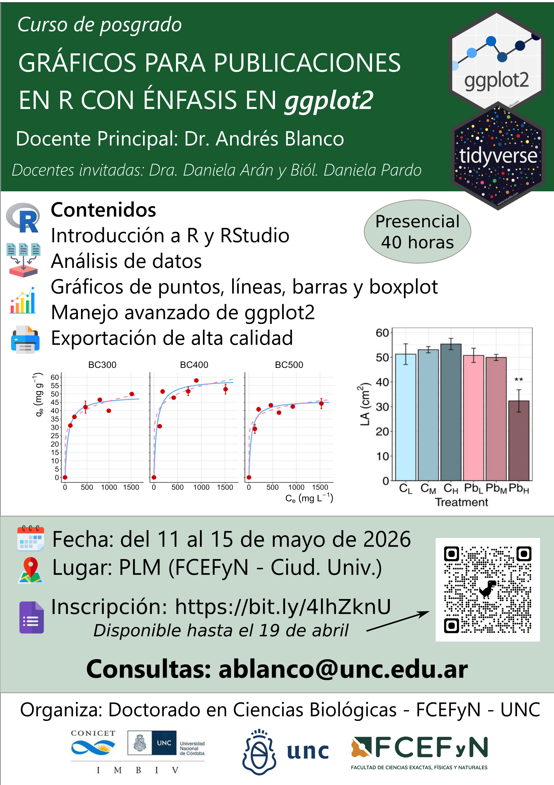

**Accedé al curso completo [aquí](curso_completo/curso_completo.qmd)**

**Descargá todo el material del curso [aquí](https://github.com/andresblanco-unc/curso_graficos_ggplot_2026/blob/main/archivos_curso_ggplot_2026.rar)**

## Bibliografía recomendada

- Carmona, D.; Benitez-Vieyra, S. Guía de campo de R. [Link](https://wiki.imbiv.unc.edu.ar/index.php?title=Guía_de_campo_de_R){target="_blank"}
- Chang, W. (2018). R graphics cookbook: practical recipes for visualizing data. O'Reilly Media. [Link](http://www.cookbook-r.com/){target="_blank"}
- Ggplot2 Reference. [Link](https://ggplot2.tidyverse.org/reference/){target="_blank"}
- Morales, J. Modelos estadísticos, una versión aplicada en R. [Link](https://bookdown.org/j_morales/librostat/){target="_blank"}
- R-Charts. Gráficos con el paquete ggplot2. [Link](https://r-charts.com/es/ggplot2/){target="_blank"}
- Tidyverse. [Link](https://www.tidyverse.org/){target="_blank"}
- Wickham, H.; Çetinkaya-Rundel, M.; Grolemund, G. (2023). R for data science. O'Reilly Media. [Link](https://r4ds.hadley.nz/){target="_blank"}

---

### Otros cursos orientados al uso de R

En el Doctorado de Ciencias Biológicas (FCEFyN, Universidad Nacional de Córdoba), se dictan con regularidad cursos introductorios y avanzados de modelos estadísticos en R:

- **Introducción al lenguaje R. Modelos lineales y fundamentos de programación**. [Ver curso](https://curso-statscba.github.io/curso-R/){target="_blank"}
- **Modelos Estadísticos Avanzados**. [Ver curso](https://curso-statscba.github.io/modelos_avanzados/){target="_blank"}
- **Fundamentos básicos del lenguaje R**. [Ver curso](https://pastornicolas.github.io/fundamentos_R/){target="_blank"}

---

## Licencia

© 2026 Andrés Blanco. Bajo licencia [Creative Commons Attribution-NonCommercial-ShareAlike 4.0 International License](http://creativecommons.org/licenses/by-nc-sa/4.0/){target="_blank"}.

