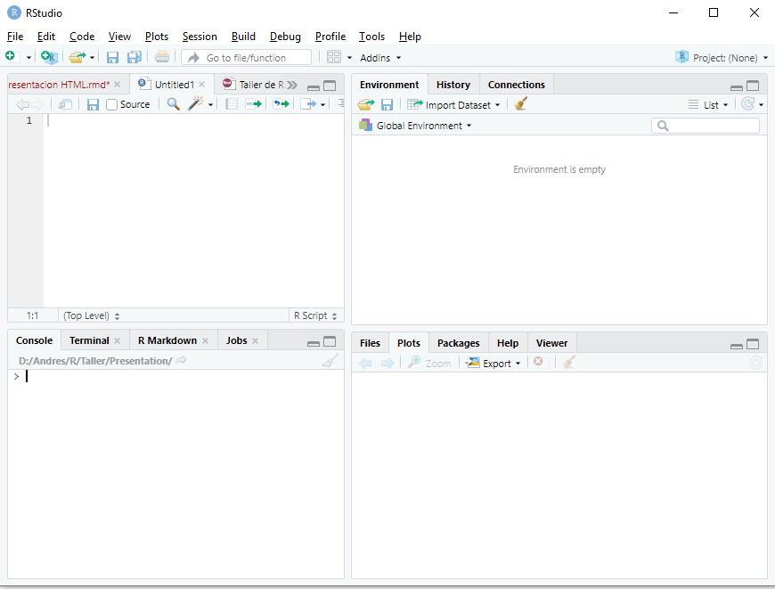

::: {style="text-align: right;"}
[Volver al inicio](../)
:::

\pagebreak

# Introducción a R y RStudio

## El lenguaje R

R es un lenguaje de escritura propio. Como todo lenguaje, tiene la gran virtud de que permite la comunicación a través de él, se puede intercambiar, podemos "hablarlo" en todas partes del mundo, compartir *scripts* con colegas y mostrarles cómo analizamos los datos. Sin embargo, su principal virtud es también su kryptonita ya que, como todo lenguaje, tiene muchos modismos. Cada persona desarrolla su propia forma de escritura, arma los *scripts* como le parece conveniente, entendible, práctico. Uno mismo a lo largo del tiempo va perfeccionando sus propios escritos, corrigiendo lo antes hecho, reescribiendo con un estilo más refinado o más avanzado.

Mi reflexión a este respecto es que la experiencia con el software es dinámica, aquí no se pretende mostrar una receta cerrada que no se puede modificar (ni mucho menos), sino simplemente acercar el programa a aquellos que aún no lo conocen y permitirles dar los primeros pasos para luego iniciar su propio camino.

## Ventajas y desventajas de R

Por supuesto este apartado es totalmente subjetivo y (al igual que todo este escrito) está enteramente marcado por mi experiencia personal. La principal desventaja salta a la vista: hay que aprender un lenguaje nuevo de escritura. De esta desventaja se desprende su principal limitación: requiere tiempo aprenderlo. El uso de R requiere tener paciencia, leer, aprender a utilizarlo, frustrarse, reintentar, googlear buscando ayuda, etc. Por otra parte, la flexibilidad de escritura a veces dificulta el entendimiento. Finalmente algo que puede parecer una desventaja (que ya veremos que no lo es) es que en algunos casos puede llevarnos bastante tiempo llegar a un gráfico aceptable de acuerdo a nuestro requerimientos, gráfico que a simple vista pareciera haber sido mucho más rápido hacerlo en otro software ya conocido (como excel).

De ahí en más, presenta muchas virtudes:

-   En primer lugar es software libre, al acceso de todos y multiplataforma.
-   Se usa en investigación en todas partes del mundo, lo que nos permite realizar intercambios con otros investigadores, mandar scripts a nuestros directores, colegas, consultar análisis de otros.
-   En lo personal, nos facilita seguir paso a paso cómo analizamos nuestros propios datos. Pongamos por caso que luego de 2 años queremos revisar unos datos que ya habíamos analizado y que nos quedaron colgados...acá podemos ver paso a paso todo lo que hicimos (también es cierto que si seguimos avanzando en el programa, nuestra forma de escritura habrá mutado, pero eso no lo hará menos entendible).
-   Otra ventaja, relacionada a la anterior, es la posibilidad de introducir comentarios en nuestros scripts. Todo lo que aparezca a la derecha del signo `#` en una línea no formará parte de la corrida. Esto nos permite agregar anotaciones, incluso resultados, hacernos recordatorios, silenciar partes del script que no queramos que se ejecuten, etc.
-   La esencia de R es la capacidad de repetición. Retomando lo que mencioné como una supuesta desventaja (pero que no lo era), una vez que logramos un gráfico (puede ser también un comando, pero vale el ejemplo) que estéticamente nos agrada, es muy sencillo extrapolar esa apariencia a otro gráfico, aún de diferente tipo. Por lo tanto, todo ese tiempo que nos llevó armarlo, es inversión y aprendizaje para que la siguiente vez todo sea más rápido.
-   El uso de funciones: relacionado al ítem anterior, y una vez que tengamos algo de manejo, podemos armar las funciones que nosotros queramos reuniendo los análisis que queramos ver y simplificar los comandos para que en una sola línea generemos mucha información.

Por supuesto que todas estas ventajas y desventajas han sufrido grandes modificaciones desde la irrupción de la inteligencia artificial. Hoy en día es muy fácil armar funciones complejas, gráficos muy avanzados y scripts infinitos sin tener grandes conocimientos. El objetivo de este curso es sentar las bases para que dicho uso sea medido y comprendido, además de poder realizar modificaciones manuales que creamos convenientes. En este sentido, es una invitación de este curso intentar trabajarlo sin la ayuda de la IA, aunque más no sea la última vez que trabajemos de esta forma.

## Instalación de R

En windows, se debe descargar la última versión de R desde su web (<https://cran.r-project.org/bin/windows/base/>), e instalarlo como cualquier otro programa.

## RStudio

RStudio es un software que nos va a permitir trabajar de un modo más amigable con R (que de forma nativa se utiliza en un entorno tipo terminal de programación). El programa es de uso libre y se descarga desde la web oficial (<https://posit.co/download/rstudio-desktop/>). Una vez que instalamos el programa y lo abrimos, nos ofrece muchísimas posibilidades. En este taller simplemente vamos a ver su uso básico.

Actualmente otros softwares están irrumpiendo en escena con bastante más soporte para inteligencia artificial (como es el caso de [Visual Code Studio](https://code.visualstudio.com/), o la versión de Posit llamada [Positron](https://posit.co/products/ide/positron/)). Sin embargo, considero que RStudio es una herramienta algo más amigable para una iniciación al software.

Al abrir el programa lo primero que destaca es que se encuentra dividido en 4 ventanas:



1.  Ventana 1 - Script de trabajo: arriba a la izquierda. En ella abriremos y editaremos nuestros scripts de trabajo. A medida que se escriben las líneas para ejecutarlas debemos posicionarnos en ella (o seleccionarla) y correrlas (Run, arriba a la derecha, o más fácil *Ctrl + r*).

2.  Ventana 2 - consola: se ubica abajo a la izquierda. En ella se nos muestra el R propiamente dicho. Todo lo que nosotros ejecutamos en la ventana 1 se corre en esta segunda ventana, donde se nos muestra el resultado de nuestra corrida. Si se quiere se puede escribir directamente en ella, pero lo que hagamos no quedará guardado en nuestro script de trabajo.

3.  Ventana 3 - objetos e historial: arriba a la derecha. Aquí podemos visualizar (en la pestaña *Environment*) todos los objetos, bases de datos, funciones, etc. que hayamos importado o creado. Es muy importante ya que nos permite tener en vista nuestro entorno de trabajo (que es una funcionalidad con la que el R nativo no cuenta, uno debe memorizar los objetos creados). Si se tilda en alguno de los objetos, es equivalente a ejecutar el comando `View()`, y nos permite visualizar en forma de tabla nuestras bases de datos (se abren en la ventana 1). Contamos aquí con una opción gráfica para importar nuestras bases de datos, pero en este curso lo haremos directamente con código. También contamos con una escoba que nos permite borrar todos los objetos que tengamos. La segunda pestaña *History* nos permite precisamente ver el historial de corridas que hayamos hecho. Allí podemos revisar comandos que ya ejecutamos y queremos repetir.

4.  Ventana 4 - gráficos, paquetes y ayuda: abajo a la derecha. Usaremos 3 de las pestañas:

-   *Plots*: aquí visualizaremos todos los gráficos que vayamos generando. Nos permite mediante las flechas de arriba a la izquierda ir viendo también los gráficos anteriores. El icono Zoom nos facilita la visualización externa del gráfico que estemos viendo. Además presenta opciones de exportación.
-   *Packages*: aquí podemos visualizar la lista completa de paquetes que tenemos instalados. Si tildamos uno lo activamos (equivalente al comando `library`, ver más adelante). Si tildamos en *Install* podemos agregar nuevos paquetes que estén en el CRAN (base de datos de librerías).
-   *Help*: como bien dice el nombre es la ventana de ayuda. Súper útil y de consulta constante. Allí podemos ver las descripciones que escribieron los creadores de cada función y/o paquete que usemos.

Como se ve RStudio nos permite realizar diversas acciones de forma gráfica, sin necesidad de utilizar código. Mi postura en general es dejar escrito en nuestro script la mayor cantidad de pasos posibles, ya que todo lo que hagamos de forma gráfica no nos queda disponible cuando volvamos a ver nuestro archivo. En este sentido, la instalación de paquetes o las búsquedas de ayuda no es algo que necesitemos en un futuro en nuestro script y podemos hacerlo de forma gráfica. Pero, contrariamente, la carga de la base de datos, paquetes, exportación de figuras, nos resultará de utilidad dejarlo plasmado en el escrito.

RStudio incluye un infinidad de opciones extra que no hacen al objetivo de este curso. Para usos más avanzados es recomendable revisar la página web de los creadores, que es muy completa e incluye muchas utilidades y tutoriales. También se encuentra mucha ayuda en la pestaña Help.

## Script de trabajo

En este apartado comenzaremos propiamente a desarrollar un script de trabajo. Iremos viendo paso a paso como avanzar en su armado, desde la carga de las librerías, introducir la base de datos y el manejo de la misma, el análisis de los datos hasta la visualización gráfica de los mismos.

Lo primero que hay que hacer un vez ingresados en RStudio es crear un nuevo script (File -\> New File -\> R Script). Allí nosotros podremos ir desarrollando los comandos correspondientes.

Todo script de trabajo tiene una estructura similar, la que yo utilizo es:

-   Carga de las librerías.
-   Carga de la base de datos.
-   Creación de las databases necesarias.
-   Armado de las funciones necesarias (si es que las tuviéramos).
-   Análisis de los datos separados por títulos.

Los títulos son marcas que hacemos para volver sencillamente a otras partes de nuestro script (tengamos en cuenta que fácilmente se superan las 1000 líneas). Para introducir un título (o marcador) colocamos la palabra clave como un comentario y agregamos una serie de signos - a la derecha. Por ejemplo:

```{r eval=FALSE}
# Librerías ------
```

A partir de este momento podemos ver nuestros títulos en 2 lugares: en la parte inferior izquierda de la ventana 1 o en la parte superior derecha de la misma ventana en el icono con la leyenda *Outline*. Esta estructuración, insisto, es muy útil para movernos dentro del documento sin perder mucho tiempo buscando algún comando. A su vez, si introducimos más \# al comienzo, se generan títulos de un nivel inferior.

## Instalación y carga de las librerías

R se maneja en base a paquetes (o librerías) que contienen las funciones que queramos utilizar. Como base R trae pre-instalados una serie de paquetes que nos sirven para realizar gran cantidad de aplicaciones. Sin embargo, es muy usual que prefiramos usar otras funciones no disponibles en la base.

Para instalar una librería debemos ejecutar el código

```{r eval=FALSE}
install.packages("nombre del paquete")
```

La instalación de paquetes debemos realizarla una única vez. Como se mencionó al describir la Ventana 4, también podemos instalar los paquetes de un modo gráfico en la pestaña Packages de RStudio.

Cada vez que ingresamos a RStudio debemos cargar nuestras librerías a utilizar. Para cargar una librería utilizamos el código

```{r eval=FALSE}
library("nombre del paquete")
```

Si queremos cargar varios paquetes, podemos ejecutar varios comandos library en una misma línea separándolos con ";", y así cargar todos en una única línea de corrida (Ctrl + r). Por otro lado, si bien uno puede tener un conjunto de paquetes que utiliza habitualmente, no es recomendable cargar de más ya que muchas veces se solapan funciones y podemos tener alguna complicación.

Para el uso de este taller, instalaremos los paquetes **agricolae**, **car**, **sciplot**, **patchwork**, **gridExtra** , **viridis** y **tidyverse**. Este último incluye una serie de paquetes en su interior, que abarcan desde funcionalidades gráficas hasta opciones del manejo de datos.

Así podemos cargarlos todos de la siguiente manera:

```{r  librerias, results='hide', message=FALSE}
library(agricolae);library(tidyverse);library(car)
library(sciplot);library(patchwork); library(gridExtra)
library(viridis)
```

## Carga de nuestros datos

Como para casi cualquier acción que queramos ejecutar en R, la carga de la base de datos puede hacerse de muchas maneras. En la ventana 3 se nos ofrece una opción gráfica (a través de "Import Dataset").

De todas maneras, es recomendable hacerlo mediante código, para que cada vez que ingresemos podamos incorporar la base de datos de manera muy sencilla.

### Establecer el directorio de trabajo

Lo primero que debemos hacer es establecer el directorio de trabajo. Para ello corremos el comando (con un directorio ejemplo):

```{r eval=FALSE}
setwd("D:/DATOS/R")
```

Si queremos revisar en qué directorio nos encontramos, ejecutamos

```{r eval=FALSE}
getwd()
```

Ahora antes de ver cómo cargar la base de datos, haremos una breve explicación de como crear la base de datos.

### Armado de la base de datos

Una vez más, aquí mostraré mi forma de armar las bases de datos, hay muchas...

La forma de la base de datos es la misma que se utiliza en otros software como Infostat. Debemos crear una columna por cada factor o variable que tengamos, y repetir el nivel del factor para cada unidad experimental (cada fila).

El formato en el que yo creo mis bases de datos es csv (archivo separado por comas). Para ello se exporta desde Excel o Calc el archivo en ese formato. El documento debe tener una única hoja con las base de datos limpia, es decir sin columnas o filas extras con comentarios, datos extra, etc. Por otro lado, es recomendable que los nombres de las columnas sean lo más cortos posibles, y que no tengan espacios. Otra recomendación es omitir el uso de tildes u otros caracteres especiales en cualquier parte del documento puede llegar a tener problemas según la codificación que usemos en RStudio. La más compatible es la UTF-8, que no suele generar problemas.

Resumiendo, la recomendación es que una vez que tenemos nuestra tabla (en Excel por ejemplo) con los datos listos, copiarla y pegarla en un documento nuevo. Allí ver de simplificar los nombres de las columnas, también de los niveles de factores a utilizar. Guardar este nuevo documento como csv, si estamos en idioma español establecer para la separación de columnas ";". Por supuesto, guardamos el archivo en el directorio de trabajo.

Para este curso utilizaremos inicialmente la base de datos "metals.csv".

### Cargando la base de datos

R es un lenguaje orientado a objetos. Por lo tanto, cargaremos nuestra base de datos como un "objeto" de R, al cual debemos asignarle un nombre. De ahí en más, cualquier acción que modifique nuestro "objeto" quedará guardada en el objeto mismo, pero no modificará nuestro archivo original (el csv en este caso). Para crear un objeto lo asignamos con "**\<-**" (de forma rápida se escribe con *Alt + -*) o con el signo "**=**".

Una primera forma de cargarla es mediante la función read.csv, y se pueden establecer un par de parámetros:

```{r}
datos_peces <- read.csv("data/peces_morfometria.csv", dec=".", sep=",")
lapply(datos_peces, class) # vemos que crea factores
```

La función que yo más utilizo es la que viene con el paquete **tidyverse**, llamada `read_csv`. Si usamos `read_csv2`, toma la coma como separador decimal:

```{r warning=FALSE}
datos_peces <- read_csv("data/peces_morfometria.csv")
```

Vemos que en este caso nos mostró directamente la clase de cada columna, y que crea objetos tipo *character* en vez de *factor*.

En la ventana 3, nos aparecerán los objetos que incorporemos.

## Caracterización de la base de datos

Para ver los primeros 6 datos y los nombres de las columnas ejecutamos la función `head`:

```{r}
head(datos_peces)
```

Para ver la tabla completa, se debe tildar en el nombre del objeto en la ventana 3. Aprovechando que tenemos la tabla a nuestra vista, daré aquí una breve descripción de los datos. Esta base de datos contiene registros morfométricos, fisiológicos y ambientales de peces colectados en tres lagunas pampeanas de la región central de Argentina. Se incluyen tres especies nativas con rangos de talla muy distintos, lo que la hace especialmente útil para explorar relaciones alométricas, correlaciones entre variables continuas y comparaciones entre grupos. Las variables registradas son:

-   **id:** Identificador numérico único de cada individuo.

-   **especie:** Especie a la que pertenece el individuo (*Odontesthes bonariensis*, *Jenynsia multidentata* o *Cichlasoma dimerus*).

-   **sitio:** Laguna de muestreo (Laguna Norte, Laguna Sur o Laguna Central).

-   **sexo:** Sexo del individuo (M/F).

-   **temporada:** Temporada de muestreo (Verano o Invierno).

-   **longitud_cm:** Longitud total del pez en centímetros.

-   **peso_g:** Peso corporal en gramos. Se relaciona con la longitud mediante una función alométrica (W = a·L\^b).

-   **temperatura_C:** Temperatura del agua en el momento del muestreo, en °C.

-   **transparencia_cm:** Transparencia del agua medida con disco de Secchi, en centímetros.

-   **cortisol_ugdL:** Concentración plasmática de cortisol en µg/dL, utilizada como indicador de estrés fisiológico.

Siguiendo con el análisis de nuestra base de datos, podemos ver un resumen de nuestra base o hacerle "preguntas" a R sobre la base de datos. Al escribir "\$" a continuación de un objeto podemos ver las columnas individuales. Por ejemplo:

```{r}
summary(datos_peces) # resumen de la base
is.double(datos_peces$temperatura_C) # double indica numérico continuo
is.character(datos_peces$longitud_cm)
levels(as.factor(datos_peces$especie)) # para ver los niveles de un factor
as.character(datos_peces$transparencia_cm)
```

### Caracterización gráfica

En este caso haremos algunos gráficos sencillos para observar la distribución de nuestra base de datos. La función `plot` (y sus derivados, como en este caso `boxplot`) viene con R base y es la forma más rápida y sencilla de graficar.

```{r, out.width='50%'}
#| layout-ncol: 2
plot(datos_peces$longitud_cm)
plot(datos_peces$longitud_cm~datos_peces$temperatura_C)
boxplot(datos_peces$peso_g~datos_peces$especie)
boxplot(datos_peces$peso_g~datos_peces$sitio)
```

## Manejo de la base de datos

### Subdividir la base de datos

Algo muy común en el trabajo en R, es la necesidad de subdividir la base de datos para utilizar únicamente una parte de ella. Veremos un par de formas de hacerlo.

Con las funciones que incluye R base, utilizaremos `subset`. Por ejemplo para elegir solo las muestras de la especie *Jenynsia multidentata*:

```{r}
JENYNSIA <- subset(datos_peces, datos_peces$especie == "Jenynsia multidentata")
```

Y creamos un objeto que se llama *JENYNSIA*, nuevamente mediante *\<-*.

Otra forma de hacerlo es mediante el uso de pipes (**%\>%**). Las pipes sirven para concatenar una serie de acciones para modificar una base de datos. En primer lugar se ubica la base a modificar y entre cada linea de comando %\>% (*Ctrl + Shift + m*). Así, podemos filtrar una base de datos con `filter`:

```{r}
Laguna_Central <- datos_peces %>% filter(sitio == "Laguna Central")
```

Si queremos filtrar por más de un parámetro:

```{r}
# en dos pasos
Peces_Invierno <- datos_peces %>% 
  filter(temporada == "Invierno") %>% # se agrega a lo anterior
  filter(especie == "Cichlasoma dimerus" | especie == "Odontesthes bonariensis")
```

### Seleccionar filas o columnas

En R base, el uso de \[ \] sirve para seleccionar filas o columnas de una database, tal que `data[filas,columnas]`. En el entorno de *dplyr* utilizaremos la función `select` para columnas:

```{r}
# seleccionar filas 1 a 3
datos_peces[1:3,]

# seleccionar columnas 1 a 3
datos_peces[,1:3]
datos_peces %>% select(1:3)

# seleccionar por nombre de la columna
datos_peces %>% select(sitio, especie)
```

### Creación de nuevas variables

Una opción muy útil ligada al paquete **dplyr** es la de transformar nuestras bases de datos para algún gráfico en particular, sin necesidad de cambiar la tabla original. Para ello utilizaremos la función `mutate`, que permite generar muchos cambios en la base de datos. Por ejemplo, en la base `datos_peces`, si queremos agregar la la variable peso por unidad de longitud:

```{r}
datos_peces <- datos_peces %>% 
  mutate("peso_relativo" = peso_g/longitud_cm) # se crea una nueva columna

# para ver la columna nueva
head(datos_peces$peso_relativo)
```

### Cambio en los niveles de un factor

También podemos cambiar los niveles de una factor `mutate`, mediante la siguiente estructura:

```{r eval=FALSE}
... %>%
  mutate(nombre_factor = fct_recode(nombre_factor,
                        "nombre nuevo" = "nombre viejo"))
```

Y podemos incluir una línea para cada nivel que queramos modificar. Por ejemplo:

```{r out.height="50%"}
datos_peces <- datos_peces %>% 
  mutate(sexo = fct_recode(sexo,
                           "Macho" = "M",
                           "Hembra" = "F"))
```

## Actividad 1

1.  Cree a partir de la base de datos original, una que contenga únicamente los individuos de la especie *Cichlasoma dimerus y Odontesthes bonariensis* que se encuentran en la Laguna Norte en invierno.
2.  Filtre la base creada para obtener otra que solo tenga aquellos individuos con peso relativo mayor a 1.

::: {style="text-align: right;"}
[Volver al inicio](../)
:::
